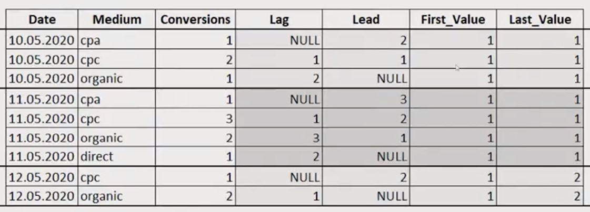
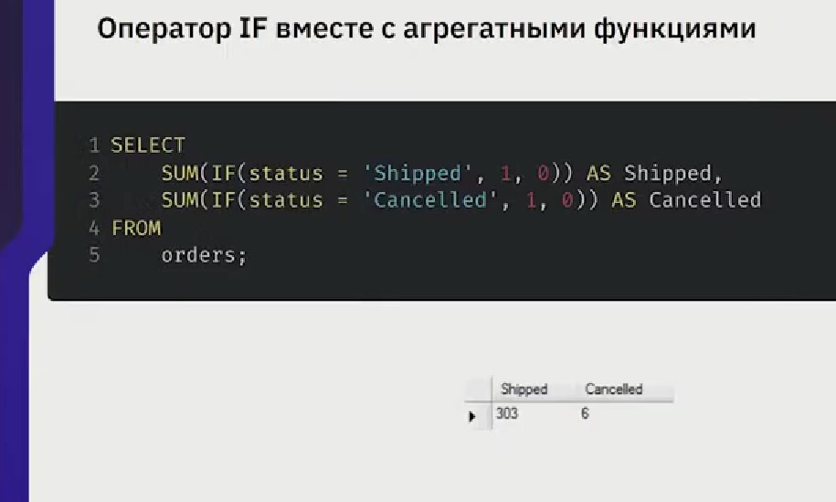

-) Какие задачи решает база даных

<details>

<summary></summary>


```javascript

- Хранение данных
- Получение данных
- Обработка


```
</details>

-) Что такое СУБД (DBMS)

<details>

<summary></summary>


```javascript

Система управления базами данных


```
</details>

-) Что такое реляционые базы даных.

<details>

<summary></summary>


```javascript

реляционые базы даных - базы данных, в которых данные распределены по отдельным, но связанным между собой таблицам

```
</details>

-) Что такое Кортеж (Tuple).
<details>

<summary></summary>


```javascript

Кортеж (Tuple) - это множестов пар (имя атрибута, значени - фактически это строка таблицы, где имена атрибутов - это стобцы таблицы)


```
</details>

-) Что такое отношение (relation)

<details>

<summary></summary>


```javascript

Отношение (relation) - это множестов кортежей, соотвествующих одной схеме (На прикладном уровне это соотносится с таблицей)


```
</details>

-) Первичный ключ (Primari key)

<details>

<summary></summary>


```javascript

Поле или набор полей позволяющиее однозначно идентифицирова запись в БД. Если ключ состоит из нескольких полей, он называется составным.


```
</details>

-) Что такое суррогатный ключ

<details>

<summary></summary>


```javascript

автоматически сгенирированное поле, никак не связанное с информационным содержанием записи


```
</details>

-) Что такое естественный ключ..

<details>

<summary></summary>


```javascript

Естественный ключ, это ключ состоящий из информационных полей таблицы


```
</details>

-) Что такое декларативное программирование

<details>

<summary></summary>


```javascript

парадигма программирования, в которой задается спецификация решения задачи, то есть описывается ожидаемый результат, а не способ его получения.


```
</details>

-) Как какому типу относится язык программирования SQL

<details>

<summary></summary>


```javascript

декларативному


```

</details>

-) Диалекты SQL

<details>

<summary></summary>


```javascript

PL/SQL (Procedural Language SQL)
Oracle

Т/SQL (Transact SQL)
MSSQL

PL/pgSQL (Procedural Language PostGres SQL)
Postgresql

Множество других
в каждой СУБД, свой диалект


```

</details>

-) Транзакция

<details>

<summary></summary>


```javascript

это набор команд или инструкций которые выполняются как единый блок


```

</details>


-) Основные операторы SQL

<details>

<summary></summary>


```javascript


Data Definition Language (DDL) - группа операторов определения данных:
- create (создание новых объектов базы данных - таблиц)
- alter (изменение существующих объектов - заполнение таблиц)
- drop (удаление объектов)

Data Manipulation Language (DML) - группа операторов для манипуляции с данными:

- insert (добавление новых данных)
- update (изменение данных)
- delete (удаление данных)
- select (выборка данных)

Data Control Language (DCL) - группа операторов определения доступа к данным:

- grant (предоставить  права на объект базы)
- revoke (отозвать у пользователя права на объект)
- deny (запрет на объект, имеет более высокий приоритет чем grant)

Transaction Control Language (TCL) - группа операций для управления транзакциями:

- begin transacton (определяем начало транзакции)
- commit transaction (применяет транзакцию, конечная точка)
- rollback transaction (откатывает все изменения транзакции)
- save transaction (устанавливает промежуточную точку сохранения внутри транзакции)


```

</details>


-) Основные компоненты СУБД

<details>

<summary></summary>


```javascript

- Storage tngine (подсистема хранения даных)
- Query parser (парсер и транслятор запросов)
- Query optimizer (оптимизатор запросов)
- Query executor (подисистема выполнения)
- Buffer cache (подсистема кэширования данных )

```

</details>

-) Подключение к СУБД, компоненты доступа

<details>

<summary></summary>


```javascript

ODBC (Open Database Connectivity)
програмный интерфейс (API) доступа к базам данных

JDBC (Java DataBase Connectivity)
программный интерфейс (API) доступа к базам данных в среде Java

Другие провайдеры


```
</details>

-) Клиентские приложения для работы с СУБД


<details>

<summary></summary>


```javascript

- Dbeaver (open-source, поддержка более 20-ти различных СУБД)

- Azure Data Dtudio (Microsoft, поддержка различных СУБД за счет плагинов)

- dbForge (компания Devart, трубуется покупка лицензии)

- DataGrip (компания JetBrain, требуется покупка лицензии)

- MSMS (компания Microsoft, только для MSSQL)

- PGAdmin (open-source, только для Postgres)


```
</details>

-) Online sql песочницы

<details>

<summary></summary>


```javascript

sqlfiddle.com

db-fiddle.com


```
</details>

-) шаблон оператора запроса выборки данных.

<details>

<summary></summary>


```javascript

SELECT поле1, поле2, поле3 from имя_таблицы
    [WHERE предложение]
    [GROUP BY {имя_столбца}]
    [HABING условие_where]
[ORDER BY {имя столбца} {ASC | DESC}, ...] [LIMIM{OFFSET M }{LIMIT N}]


```
</details>

-) Команда создания базы данных через терминал

<details>

<summary></summary>


```javascript

CREATE DATABASE MySampleDB;


```
</details>

-) Команда просмотра созданных баз данных с помощью терминала 

<details>

<summary></summary>


```javascript

show databases


```
</details>

-) Оператор подключения к базе данных

<details>

<summary></summary>


```javascript

use nameDB (оператор плюс имя базы)


```
</details>

-) создание таблицы

<details>

<summary></summary>


```javascript

CREATE TABLE tadle_name
(
    column_name_1 column_type_1,
    column_name_2 column_type_2,
    ... ,
    column_name_N column_type_N,

); 


```

</details>

-) Основные типы данных mySQL

<details>

<summary></summary>


```javascript

1. Числовые:

INT (целочисленное значение от -2147483648 до 2147483647, хранится в 4 байтах)
DECIMAL (хранит числа с заданной точностью от -999.99 до 999.99)
BOOL (0 или 1, т.е. false или true)

2. Символьные

VARCHAR(N) (N - опредеяет максимально возможную длину строки)
TEXT ( содержит множество VARCHAR(N), подходит для хранения большого объема текста до 65 kb, например целой статьи)

3. дата и время

DATE (только дата. Диапазон от 1000-01-01 по 9999-12-31)
TIME (только время - часы, минуты, секунды - "hh:mm:ss" содержится в 3 байтах)
DATETIME (объединяем оба предыдущих типа - дату и время. Использует 8 байт памяти)
TIMESTAMP (хранит дату и время начиная с 1970 года)

4. бинарный

BLOB (до 65 кб бинарных данных)
LARGEBLOB (до 4 гб)


```
</details>

-) Синтаксис первичного ключа

<details>

<summary></summary>


```javascript

CREATE TABLE table_name
(
    column1 column_definition,
    column2 column_definition,
    CONSTRAINT [constraint_name]
    PRIMARY KEY [USING BTREE | HASH] (column_1, column_2, ... column_n)
);


```
</details>

-) синтаксис внешнего ключа ( key(fk))

<details>

<summary></summary>


```javascript

[CONSTRAINT имя_ограничения]
FOREIGN KEY (столбец1, столбец2, ... столбецN)
REFERENCES главная таблица (столбец_главной_таблицы1,
столбец_главной_таблицы2, ... столбец_главной_таблицыN)
[ON DELETE действие]
[ON UPDATE действие]

комментарий: указывается от куда идет внешний ключ и к какой таблице
```
</details>

-) Пример таблиц имеющих связь

<details>

<summary></summary>

```javascript

CREATE TABLE Customers           
(
    ID INT PRIMARY KEY AUTO_INCREMENT,
    Age INT,
    FirstName VARCHAR(20) NOT NULL,
    Pho ne VARCHAR(20) NOT NULL UNIQUE
);

CREATE TABLE Orders
(
    id INT PRIMARY KEY AUTO_INCREMENT,
    CustomerId INT,
    CreatedAt Date,
    FOREIGN KEY (CustomerId) REFERENCES Customers (Id
    );
)


```
</details>

-) Способы создания комментариев

<details>

<summary></summary>


```javascript

-- Комментарий


# Это комментарий


/*

и это комментарий

*/


```

</details>


-) Логические операторы

<details>

<summary></summary>


```javascript

AND (операция логического И, объяденяет два выражения. Синтаксис: выражение1 AND выражение2)

OR (операция логического или, так же объединяе два выражения: выражение1 OR выражение2)

NOT (операциия логического отрицания. Если выражение в этой операции ложно, то общее условие истино и наоборот: NOT выражение)

Пример запроса возвращающего не нулевые и неповторяющиеся значения из таблицы:

SELECT DISTINCT city FROM customers
WHERE city IS NOT NULL;


```
</details>

-) Примеры запросов с использование операторов AND, OR, NOT.

<details>

<summary></summary>


```javascript

SELECT * FROM Products
WHERE Manufacturer = 'Samsung' AND Price > 50000;

SELECT * FROM Products
WHERE Manufacturer = 'Samsung' OR Price > 50000;

SELECT * FROM Products
WHERE NOT Manufacturer = 'Samsung';


```
</details>

-) Приоритет операций и способ переопределения приоритета.


<details>

<summary></summary>


```javascript

В выражении:

SELECT * FROM Products
WHERE Manufacturer = 'Samsung' OR NOT Price > 30000 AND ProductCount > 2;

Первым выполняется отрицание (в данном случае цена должна быть менее 30000 рублей);

Вторым выполняется оператор AND (в данном случае количество товаров должно быть меньше указанного значения);

Третьем выполняется оператор OR;

ПЕРЕОПРЕДЕЛЕНИЕ ПРИОРИТЕТА:

SELECT * FROM Products
WHERE Manufacturer = 'Samsung' OR NOT (Price > 30000 AND ProductCount > 2);

результат: в первую очередь выполняется выражение в скобках.


```
</details>

-) Оператор позволяющий проверить условие.

<details>

<summary></summary>


```javascript
синатксис:

CASE
    WHEN условие_1 THEN результат_1
    WHEN условие_2 THEN результат_2
    ................................
    WHEN условие_N THEN результат_N
    [ELSE альтернативный_результат]
END


пример использования:

SELECT ProductName, ProductCount,
CASE
    WHEN ProductCount = 1
        THEN 'Товар заканчивается'
    WHEN ProductCount = 2
        THEN 'Мало товара'
    WHEN ProductCount = 3
        THEN 'Есть в наличии'
    ELSE 'Много товара'
END AS Category
FROM Products;

В данном примере добавляем поле с соответствующим сообщением в зависимости от количества  товара.

```
</details>

-) Пример выводит значения id таблицы которые отсутствуют в другой таблице, а значения тех id, что имеются в другой таблице выводит как 0. 

<details>

<summary></summary>


```javascript

SELECT test_a.id_number, test_a.data, @var,
	   CASE
       WHEN exists (SELECT test_b.id_number 
       FROM  test_b WHERE test_b.id_number = test_a.id_number) THEN @var:=0
       ELSE @var:=test_a.id_number
       END As resulte 
FROM  test_a 

```
</details>

-) оператор возвращающий значение в зависимости от условия (true\ false)


<details>

<summary></summary>


```javascript

СИНТАКСИС:

IF(условие, значание_1, значение_2)
# если true возвращается первое значение, если false - тогда второе.

пример:

SELECT ProductName, Manefacturer,
    IF (ProductCount > 3, 'Много товара','Мало товара')
FROM Products; 

примечание: в данном контексте выражение является одновременно и именем столбца(колонки), т.к. не указали с помощью оператора AS имя.

```
</details>

-) Запрос изменения данных

<details>

<summary></summary>


```javascript

INSERT

имеет 2 основных формы:

1. INSERT INTO таблица (перечень_полей)
VALUES (перечень_значений) - вставка в таблицу новой строки значения полей которой формируются из перечисленных значений.

Пример 1.:

CREATE TABLE Products
(
    Id INT AUTO_INCREMENT PRIMARY KEY,
    ProductName VARCHAR(30) NOT NULL,
    Manufacturer VARCHAR(20) NOT NULL,
    ProductCount INT DEFAULT 0,
    Price DECIMAL
);
INSERT INTO Products (ProluctName, Manufacturer, ProductCount, Price)
VALUES
('iPhone X', 'Apple', 3, 76000),
('iPhone 8', 'Apple', 2, 51000),
('Galaxy S9', 'Samsung', 2, 56000),
('Galaxy S8', 'Samsung', 1, 41000);


2. INSERT INTO таблица (перечень_полей) SELECT
перечень_значений FROM ... - вставка в таблицу новых строк, значения которых формируются из значений строк возращенных запросом.


```
</details>

-) Обновление какой-либо информации в таблице.

<details>

<summary></summary>


```javascript

UPDATE

СИНТАКСИС:
UPDATE имя_таблицы
SET столбец1 = значение1, столбец2 = значение2, ... столбецN = значениеN
[WHERE условие_обновления]

ПРИМЕР:
UPDATE Products
SET Price = Price + 3000;

(увеличивает цену у всех товаров на 3000)

КОММЕНТАРИЙ: в данном случае используем дополнительно оператор SET, чтобы установить новое значение


```
</details>

-) Оператор удаления

<details>

<summary></summary>


```javascript

DELETE

СИНТАКСИС:

DELETE FROM имя_таблицы
[WHERE условие_удаления]

ПРИМЕР:

DELETE FROM Products
WHERE Manufacturer = 'Huawei';

(удаляет строки, у которых производитель - Huawei) 


```
</details>

-) Примеры запросов на выборку с использованием оператора IN

<details>

<summary></summary>


```javascript

SELECT * FROM products
WHERE Manufacturer IN ('Apple', 'Samsung');
(выбрать строки где в поле Manufacturer указаны производители: 'Apple', 'Samsung')

SELECT * FROM products
WHERE NOT Manufacturer IN ('Apple', 'Samsung');
(выбрать строки где в поле Manufacturer указаны производители все за исключением: 'Apple', 'Samsung')

```
</details>

-) Какая команда позволяет избежать ошибки при создании таблицы, если таблица с таким именем уже существует.

<details>

<summary></summary>


```javascript

IF NOT EXISTS

ПРИМЕР:

CREATE TABLE IF NOT EXISTS movies
(
id INT NOT NULL AUTO_INCREMENT PRIMARY KEY,
title CHAR(100) NOT NULL,
year YEAR NOT NULL,
time INT NOT NULL,
storyline TEXT 
);

комментарий:
в данном контексте таблица создается, только в то случает, если таблицы с таким именем в базе нет.

```
</details>

-) Добавить столбец в таблицу

<details>

<summary></summary>


```javascript

ALTER TABLE movies  
ADD language VARCHAR(20);

(добавляет столбец с именем language поля которого имеют тип VARCHAR(20), длиной соотвественно не более 20 симоволов)

```
Пример:

1. ввод команды на добавление столбца


2. результат выполнения команды


</details>

-) Удалить столбец таблицы пример

<details>

<summary></summary>


```javascript

ALTER TABLE movies
DROP COLUMN language;

(удаляется столбец с именем language)


```
</details>

-) Добавить столбец TestString в таблицу test

<details>

<summary></summary>

```javascript

ALTER TABLE test 
ADD COLUMN TestString VARCHAR(40);


```
</details>

-) Вставить после создания таблицы, в нее внешний ключ. Пример.

<details>

<summary></summary>


```javascript

 ALTER TABLE seminar1.movies
 ADD FOREIGN KEY(director_id) 
 REFERENCES seminar1.directors(id)

 (примечание: естественно работает только при наличии в таблицах полей которые участвывают в выражении)


```
</details>

-) заполнить поля внеших ключей после их создания. Пример.

<details>

<summary></summary>


```javascript

UPDATE movies SET director_id = 4 WHERE id = 1;
UPDATE movies SET director_id = 3 WHERE id = 2;
UPDATE movies SET director_id = 7 WHERE id = 3;
UPDATE movies SET director_id = 1 WHERE id = 4;


```
</details>

-) 1.создать таблицу (с именем - parent) с первичным ключом. 2. создать таблицу (с именет - child) с внешним ключом ссылающуюся на предыдущую таблицу (parent). 3.заполнить первую таблицу (parent) значениями 4.# заполнить вторую таблицу (child) значениями.

<details>

<summary></summary>


```javascript

# 1.создать таблицу с первичным ключом:

CREATE TABLE parent(
id INT NOT NULL,
PRIMARY KEY (id)
) ENGINE=INNODB;

# 2. создать таблицу с внешним ключом ссылающуюся на предыдущую таблицу.

CREATE TABLE child(
id INT,
parent_id INT,
INDEX par_int(parent_id),
FOREIGN KEY (parent_id)
REFERENCES parent(id)
ON DELETE CASCADE
)ENGINE=INNODB

# заполнить первую таблицу (parent) значениями:

INSERT INTO parent VALUES (234), (238);


# заполнить вторую таблицу (child) значениями:

INSERT INTO child VALUES (1,234), (2,234), (3,238);

```
</details>

-) Пример удаления таблицы с именем Test

<details>

<summary></summary>

```javascript

DROP TABLE Test;

```
</details>

-) LEFT JOIN пример.

<details>

<summary></summary>


```javascript

SELECT * FROM movies LEFT JOIN directors ON director_id = directors.id


```
</details>

-) Пример использования As, для изменения наименований или форимата вывода имен столбцов

<details>

<summary></summary>


```javascript
было:

ELECT title, name, time FROM movies LEFT JOIN directors ON director_id = directors.id WHERE (time > 160) AND (time < 170)              

стало:

SELECT title As Title, name As Name, time As Time FROM movies LEFT JOIN directors ON director_id = directors.id WHERE (Time > 160) AND (Time < 170) 


```
</details>

-) Пример использования оператора CASE

<details>

<summary></summary>


```javascript

SELECT title, name, time, 
CASE
	WHEN time >= 140 AND time < 150 THEN 'SHERT'
    WHEN time >= 150 AND time < 170 THEN 'MIDDLE'
    WHEN time >= 170 THEN 'LONG'
END as timer
FROM movies LEFT JOIN directors ON director_id = directors.id;

```
</details>

-) Пример использования оператора IF

<details>

<summary></summary>


```javascript

SELECT title, name, time, 
IF(time < 160, 'done', 'false') as Ready
FROM movies LEFT JOIN directors ON director_id = directors.id;


```
</details>


-) Синтаксис сортировки по указанному полю

<details>

<summary></summary>


```javascript

SELECT expressions
FROM tables
[WHERE conditions ]
ORDER BY expresions [ASC| DESC]; 


```
</details>

-) Пример использования псевдонима


<details>

<summary></summary>


```javascript

SELECT ProductName, ProductCount * Price AS TotalSum
FROM Products
ORDER BY TotalSum;


```
</details>

-) Ограничение выборки

<details>

<summary></summary>


```javascript

синтаксис:

SELECT поля_выборки
FROM список_таблиц
LIMIT [количество_пропущенных_записей,] количество_записей_для_вывода;

ПРИМЕР1:

SELECT * FROM Products
LIMIT 3;

результат:
происходит вывод первых 3 строчек таблицы

ПРИМЕР2:

 SELECT * FROM Products
LIMIT  2, 3;

результат:
происходит вывод трех строчек, ну только после пропуска первых двух

В базе данных
MS SQL Server используется несколько отличный диалект,
пример:

SELECT TOP 2 *
FROM Object

результат: выводит первый две строки из таблицы Object

```
</details>

-) Ограничение выборки: fetch

<details>

<summary></summary>


```javascript

Синтаксис оператора FETCH в MySQL:

SELECT ColumnNames FROM TableName ORDER BY ColumnName OFFSET
rows_to_be_skepped FETCH NEXT n ROWS ONLY;

ПРИМЕР:
SELECT ColumnName FROM TableName ORDER BY ColumnNames OFFSET m ROWS
FETCH NEXT p ROWS ONLY;

результат: будут исключаться m строк и производитья выборка следующих p строк- будут выведены строки от (m+1) до (m+1+p).


```
</details>

-) Уникальные значения - distinct

<details>

<summary></summary>


```javascript

Уникальные значения - distinct, вывод уникальных производителей:

SELECT DISTINCT Manufacturer FROM Products;

результат: выведены наименования уникальных производителей без повторений.

ПРИМЕР ВЫВОДА УНИКАЛЬНЫХ ЗНАЧЕНИЙ ПО НЕСКОЛЬКИМ ПОЛЯМ:

SELECT DISTINCT Manufacturer, ProductCount FROM Products;

Пример (выводятся не повторяющиеся и не равные null значения):
SELECT DISTINCT city FROM customers
WHERE city IS NOT NULL;


```
</details>

-) Выборка с группировкой

<details>

<summary></summary>


```javascript

СИНТАКСИС:
 
SELECT столбцы
FROM таблица
[WHERE условие_фильтрации_строк]
[GROUP BY столбцы_для_групировки]
[HAVING условие_фильтрации_групп]
[ORDER BY столбцы_для_сортировки]

ПРИМЕР:

SELECT Manufacturer, COUNT(*) AS ModelsCount
FROM Products
GROUP BY Manufacturer;


```
</details>

-) ограничение количества строк по сгрупированным атрибутам

<details>

<summary></summary>


```javascript

Использование HAVING

СИНТАКСИС:

SELECT expression1, expression2, ... expressin_n,
    aggregate_function(expression)
FROM tadles
[WHERE conditions]
GROUP BY expression1, expression2, ... expression_n

комментарий: 
1)aggregate_function - представляет из себя одну из функций таких как, SUM, COUNT, MIN, MAX, AVG
2) expression1, expression2, ... expression_n - выражения, которые не заключены в агрегированную функцию и должны быть включены в предложение GROUP BY
3) WHERE conditions - необязательный параметр. Это уловие для выбора записей
4) HAVING condition - это дополнительное условие применяется только к агрегированным результатам для ограничения групп возращаемых  строк

ПРИМЕР:

SELECT Manufacturer, COUNT(*) AS ModelsCount
FROM Products
GROUP BY Manufacturer
HAVING COUNT(*) > 1;

комментарий: через атрибут Manefacturer c помощью функции COUNT(*) в поле c установленным псевдонимом ModelsCount находим общее колличество сторок с моделями производителлей в таблице Products. Далее проводим групировку по полю Manufacturer, задавая при этом уловие HAVING COUNTT(*) > 1, т.е. колличество строк удовлетворяющих заданным условиям больше одной.

```
</details>

-) Найти среднее значение

<details>

<summary></summary>


```javascript

Агрегатная функция:   AVG, позволяет найти среднее значение

ПРИМЕР:

SELECT AVG(Price) AS Average_Price FROM Products
 
Результат: с использованием псевдонима для имени столбца выводится среднее значение столбца Price.

ПРИМЕР С ИСПОЛЬЗОВАНИЕМ ДОПОЛНИТЕЛЬНОЙ ФИЛЬТРАЦИИ:

SELECT AVG(Price) AS Average_Price FROM Products 
WHERE Manufacturer = 'Apple';

Результат: выводится среднее значение по столбцу Price, только для марки 'Apple'

```
</details>

-) Функция позволяющая получить колличество строк

<details>

<summary></summary>


```javascript

ПРИМЕР:

SELECT COUNT(*) FROM Products;

Результат: выводится резyльтат подсчета колличества строк в таблице Products.


```
</details>

-) Получить минимальное и максимальное значение 

<details>

<summary></summary>


```javascript

ПРИМЕР:

SELECT MIN(Price), MAX(Price) FROM Products;


```
</details>


-) Ошибка

<details>

<summary></summary>


```javascript
Рекомендованный GB запрос на создание таблицы:
CREATE TABLE Products(
    Id INT AUTO_INCREMENT PRIMARY KEY,
    ProductName VARCHAR(30) NOT NULL,
    Manufacturer VARCHAR(20) NOT NULL,
    ProductCount INT DEFAULT 0.
    Price DECIMAL NOT NULL
);
INSERT INTO Products(ProductName, Manufacturer, ProductCount, Price) VALUES
('iPhone X', 'Apple', 3, 76000),
('iPhone 8', 'Apple', 3, 51000),
('iPhone 7', 'Apple', 3, 32000),
('Galaxy S9', 'Samsung', 2, 56000),
('Galaxy S8', 'Samsung', 1, 46000),
('Honor 10', 'Huawei', 5,28000),
('Nokia 8', 'HMD Globad', 6, 38000);

Запрос:

SELECT Manufacturer, COUNT(*) AS Models,  Price, ProductCount 
FROM Products
WHERE Price > 40000
GROUP BY Manufacturer;

Результат:

Error Code 1055. Expression «3 of SELECT list is not in GROUP BV clause end contains nonaggregated column 'myfii stdb.Products.Price which is not functioned? dependent on columns in GftOUP BY clause this is incompatible Mich jql_mode-oriry_f ull_group_by

Машинный перевод:

Код ошибки 1055. Выражение «3 из списка ВЫБОРА не входит в группу" в конце предложения содержит неагрегированный столбец 'myfii stdb.Продукты.Цена, которая не функционирует? зависит от столбцов в предложении GftOUP BY, это несовместимо с jql_mode-oriry_full_group_by


```
</details>

-) вывести все свойства таблицы ее атрибутов

<details>

<summary></summary>


```javascript

пример для таблицы с наимерование phones:

mysql> SHOW FULL COLUMNS FROM phones;

результат в MYSQL LINE АГЕНТ (ЕСЛИ ПРАВИЛЬНО УКАЗАЛ ПРОГРАММУ):

+----------+-------------+--------------------+------+-----+---------+----------------+---------------------------------+---------+
| Field    | Type        | Collation          | Null | Key | Default | Extra          | Privileges
    | Comment |
+----------+-------------+--------------------+------+-----+---------+----------------+---------------------------------+---------+
| id       | int         | NULL               | NO   | PRI | NULL    | auto_increment | select,insert,update,references |         |
| name     | varchar(30) | utf8mb4_0900_ai_ci | NO   |     | NULL    |                | select,insert,update,references |         |
| brand    | varchar(30) | utf8mb4_0900_ai_ci | YES  |     |         |                | select,insert,update,references |         |
| price    | int         | NULL               | YES  |     | 0       |                | select,insert,update,references |         |
| pcount   | int         | NULL               | YES  |     | 0       |                | select,insert,update,references |         |
| brand_id | int         | NULL               | YES  |     | NULL    |                | select,insert,update,references |         |
+----------+-------------+--------------------+------+-----+---------+----------------+---------------------------------+---------+
6 rows in set (0.00 sec)


```
</details>

-) пример использования наиболее популярных агрегатных функций совместно с GROUP BY

<details>

<summary></summary>


```javascript

SELECT brand, 
	COUNT(*) AS Counter, 
	SUM(pcount) AS phones_COUNT,
	AVG(price) AS AVG_Price,
	MIN(price) AS MinPrice,
	MAX(price) AS MAXPrece
FROM phones
GROUP BY brand

Пример (запрос на выборку заказа с минимальной суммой для каждого конкретного заказчика):

SELECT MIN(amt), customers.cname
FROM orders
LEFT JOIN customers
ON customers.cnum = orders.customerscnun
GROUP BY customers.cname


```
Еще пример SUM

[sum.jpg](sum.jpg)

</details>

-) пример использования маски LIKE 

<details>

<summary></summary>


```javascript

SELECT brand, 
	COUNT(*) AS Counter, 
	SUM(pcount) AS phones_COUNT,
	AVG(price) AS AVG_Price,
	MIN(price) AS MinPrice,
	MAX(price) AS MAXPrece
FROM phones
WHERE name LIKE '%a%'
GROUP BY brand


```
</details>

-) Пример использования HABING в пределах GROUP BY

<details>

<summary></summary>


```javascript
ПРИМЕР 1:

SELECT brand, 
	COUNT(*) AS Counter, 
	SUM(pcount) AS phones_COUNT,
	AVG(price) AS AVG_Price,
	MIN(price) AS MinPrice,
	MAX(price) AS MAXPrece
FROM phones
WHERE name LIKE '%a%'
GROUP BY brand
HAVING AVG(price) > 20000

ПРИМЕР2:

SELECT brand, 
	COUNT(*) AS Counter, 
	SUM(pcount) AS phones_COUNT,
	AVG(price) AS AVG_Price,
	MIN(price) AS MinPrice,
	MAX(price) AS MAXPrece
FROM phones
WHERE name LIKE '%a%'
GROUP BY brand
HAVING COUNT(*) >= 2


```
</details>

-) Модифицировать поле созданной таблицы (в данному примере изменить размер поля таблицы)

<details>

<summary></summary>


```javascript

Пример (имя таблицы - sale, имя изменяемого атрибута - typebike, тип - vachar, новая длина поля - 60):

ALTER TABLE sale
MODIFY typebike
varchar(60);


```
</details>

-) Оператор UNION, синтаксис и для чего предназначен

<details>

<summary></summary>


```javascript

оператор UNION - предназначен для объединения двух запросов

СИНТАКСИС:
SELECT...
UNION [ALL|DISTINCT] SELECT...
[UNION [ALL|DIXTINCT]SELECT...]


дополнительная информация: разное количество столбцов и строчек при использовании UNION может привести к ошибке.

```


</details> 


-) Сложить выборку столбцов одной таблицы с выборкой столбцов другой таблицы.

<details>

<summary></summary>


```javascript

Для этого используем оператор UNION

ПРИМЕР:

SELECT FirstName, LastName
FROM Customers
UNION SELECT FirstName, LastName FROM Employtes;

примечание: получает при сложении столцов таблиц вместо 10 только 8 строк, т.к. повторы значений при выполнении данного синтаксиса запроса исключаются.

ТОТЖЕ СИНТАКСИС С СОЗДАНИЕМ БАЗОВЫХ ДЛЯ ПРИМЕРА ТАБЛИЦ:

CREATE TABLE Customers
(
id INT AUTO_INCREMENT PRIMARY KEY,
FirstName VARCHAR(20) NOT NULL,
LastName VARCHAR(20) NOT NULL,
AccountSum DECIMAL
);
CREATE TABLE Employtes
(
id INT AUTO_INCREMENT PRIMARY KEY,
FirstName VARCHAR(20) NOT NULL,
LastName VARCHAR(20) NOT NULL
);

INSERT INTO Customers(FirstName, LastName, AccountSum)
VALUES
('Tom', 'Smith', 2000),
('Sam', 'Brown', 3000),
('Mark', 'Adams', 2500),
('Paul', 'Ims', 4200),
('John', 'Smith', 2000),
('Tim', 'Cook', 2000);

INSERT INTO Employtes(firstName, LastName)
VALUES
('Homer', 'Simpson'),
('Tom', 'Smith'),
('Mark', 'Adams'),
('Nick', 'Hoys');

SELECT FirstName, LastName
FROM Customers
UNION SELECT FirstName, LastName FROM Employtes;


```
</details>

-) Сложить выборку столбцов одной таблицы с выборкой столбцов другой таблицы без исключения повторов.

<details>

<summary></summary>


```javascript

SELECT FirstName, LastName
FROM All Customers
UNION SELECT FirstName, LastName FROM Employtes;


```
</details>

-) Увеличение суммы (добавления процента от суммы) пример.

<details>

<summary></summary>


```javascript

SELECT FirstName, LastName, AccountSum + AccountSum * 0.1 AS TotalSum
FROM customers WHERE AccountSum < 3000
UNION SELECT FirstName, LastName, AccountSum + AccountSum * 0.3 AS iTotalSum
FROM customers WHERE AccountSum >=  3000;

Пример с практической работы (показывает выборку марки авто с колличеством всех авто, кроме указанной марки):

SELECT DISTINCT mark AS OthersNum
FROM auto
WHERE mark = 'BMW'
UNION SELECT DISTINCT count(*) 
FROM auto
WHERE mark != 'BMW'

Еще пример с практической работы:
-- Вывести на экран сколько машин каждого цвета для машин марок BMW и LADA:

SELECT DISTINCT mark, 
color, count(mark)  
OVER (PARTITION BY color) AS 'ColourCount'
FROM auto
WHERE mark = 'BMW'
UNION SELECT DISTINCT mark, 
color, count(mark)  
OVER (PARTITION BY color) AS 'ColourCount'
FROM auto
WHERE mark = 'lADA';

```
</details>

-) INNER JOIN

<details>

<summary></summary>


```javascript

SELECT столбцы
FROM та6лица1
[INNER] JOIN таблица2 ON условие1 [[INNER] JOIN таблица ON условие2]


```
</details>

-) Пример использования INNER JOIN, с созданием в начале базовых таблиц для примера.

<details>

<summary></summary>


```javascript

CREATE TABLE Products2
(
Id   INT  AUTO_INCREMENT  PRIMARY  KEY,
ProductName  VARCHAR(30)   NOT NULL, 
Manufacturer VARCHAR(20) NOT NULL, 
ProductCount   INT  DEFAULT 0, 
Price2 DECIMAL NOT NULL
);

CREATE  TABLE  Customers2
(
Id  INT  AUTO_INCREMENT  PRIMARY KEY,
FirstName  VARCHAR(30)  NOT  NULL
);

CREATE TABLE Orders2
(
Id INT AUTO_INCREMENT PRIMARY KEY,
ProductId INT NOT NULL,
CustomerId INT NOT NULL,
CreatedAt DATE NOT NULL,
ProductCount INT DEFAULT 1,
Price DECIMAL NOT NULL,
FOREIGN KEY (ProductId) REFERENCES Products2(Id) ON DELETE CASCADE,
FOREIGN KEY (CustomerId) REFERENCES Customers2(Id) ON DELETE CASCADE

);

```
</details>

-) синтаксис OUTER JOIN

<details>

<summary></summary>


```javascript

SELECT столбцы
FROM таблица1
    {LEFT|RIGHT} [OUTER] JOIN таблица2 ON условие1
    [{LEFT|RIGHT}[OUTER] JOIN таблица3 ON условие] ...

    Выборака таблицы с права и пересечение с лева и наоборот

        Например (LEFT JOIN):

    SELECT FirstName, CreatedAt, ProductCount, Price, ProductId
    FROM Orders LEFT JOIN Customers
    ON Orders.CustomerId = Customers.Id

        Например (RIGHT JOIN):

    SELECT FirstName, CreatedAt, ProductCount, Price, ProductId
    FROM Customers RIGHT JOIN Orders
    ON Orders.CustomerId = Customers.Id

    комментарий: как я понял, это есть раннее рассматривавшийся LEFT JOIN и RIGHT JOIN


```
</details>

-) Особенность FULL JOIN ДЛЯ MySQL

<details>

<summary></summary>


```javascript

MySQL реализация на прямую FULL JOIN не предусмотрена, возможна только реализация с использованием UNION.
С помощью UNION объединяется LEFT JOIN и RIGHT JOIN. Использование псевдонимов для сокращения количества символов в именах таблиц.

например:

SELECT p.product_name, c.category_name
FROM products P
LEFT JOIN categories c 
ON p.category = c.catgory_id

UNION

SELECT p.product_name, c.category_name
FROM products P
RIGHT JOIN categories c 
ON p.category = c.category_id;


```
</details>

-)CROSS JOIN (Декартово произведение)

<details>

<summary></summary>


```javascript


```
</details>

-) Краткое описание Join

<details>

<summary></summary>


```javascript

-


```
</details>

-) Использование оператора IN в подзапросе, для выбора записей имеющих заказы

<details>

<summary></summary>


```javascript

Для этого создаем запрос:

SELECT * FROM Products
WHERE Id IN (SELECT ProductId FROM Orders)

Комментарий: выбираем все строки в которых ейсть значения Id


При выборе товаров на которые нет заказов используем противоположный запрос:

SELECT * FROM Products
WHERE Id NOT IN (SELECT ProductId FROM Orders)


```
</details>

-) Использование оператора EXISTS 

<details>

<summary></summary>


```javascript

оператор EXISTS возвращает либо true, либо false

Синтаксис:

WHERE [NOT] EXISTS (подзапрос)

Пример1:

SELECT * FROM Products
WHERE EXISTS
(SELECT * FROM Orders WHERE Orders.ProductId = ProductId)

Комментарий: Если заданное условие истинное (в данном случае, при наличи равенства Id у двух различных таблиц в текущей строке) EXISTS возвращает true, а в противоположном случае - false

Пример2:

SELECT COUNT(*) AS AvailabilityOfCities FROM customers
WHERE NOT EXISTS
(SELECT city FROM customers WHERE customers.city = NULL); 

Комментарий: возвращает колличество не нулевых значений поля city из таблицы customers

Пример3: возвращает строки с id значение котрого отсутствует в другой таблице

SELECT test_a.id_number, test_a.data  FROM test_a
WHERE NOT EXISTS (SELECT test_b.id_number FROM  test_b  WHERE test_b.id_number = test_a.id_number)

```
</details>

-) Использование в подзапросе оператора CREATE TABLE SELECT

<details>

<summary></summary>


```javascript

Оператор CREATE TABLE SELECT позволяет создать и клонировать содержание таблицы

Пример:
-- 1) Создаем таблицу test
CREATE TABLE test
(Id INT,
Name VARCHAR(45)
);

-- 2) Заполняем таблицу test значениями

INSERT test VALUES
(1, 'Bob'),
(2, 'Tom'),
(3, 'Tim');

-- 3) Выводим в примере значения таблицы test
SELECT * FROM test;

-- 4) Создаем таблицу copy и одновременно заполняем ее полным содержимым таблицы test.
--    Таким образом создаем таблицу copy, которая является копией таблицы test
CREATE TABLE copy SELECT * FROM test;

-- 5) Проверяем таблицу copy

SELECT * FROM copy; 


```
</details>

-) ПОРЯДОК ВЫПОЛНЕНИЯ ОПЕРАТОРОВ ЗАПРОСА

<details>

<summary></summary>


```javascript

ПОРЯДОК ВЫПОЛНЕНИЯ:

1  SELECT  [DISTINCT | ALL]  поля_та6лиц (5 выбираем столбцы (атрибуты) используя выборку данных)
2  FROM список_таблиц                   (1 создаем таблицу)
3  [WHERE условия_на_ограничение строк] (2 фильтруем, убираем лишнии данные)
4  [GROUP  BY условия_группировки]      (3 групировка)
5  [HAVING условия на ограие строк_после_группировки] (4 фильтрует лишнее поле групировки)
6  [ORDER BY псрядок_сортировки   [ASC | DESC]] (6 сортировка данных)
7  [LIMIT ограничение_количества_записен] (7 ограничиваем количество выводимых записей)


```
</details>

-) Синтарксис оконной функции

<details>

<summary></summary>


```javascript

-


```
</details>

-) С помощью оконной функции высчитывает значение которое помещается в дополнительно создающейся столбец запроса. 

<details>


<summary></summary>


```javascript

-


```
</details>

-) Пример просумировать все значения с выводом в каждой строке в пределах нового сгенерированного столбца

<details>


<summary></summary>


```javascript

SELECT Datte, medium, conversions, SUM(Conversions) OVER() AS 'Sum'
FROM orderr;


```


</details>

-) Пример с помощью оконной функции (с агрегирующей функцией SUM) суммируем значения атрибута Conversions и групируем по дате - атрибут datte

<details>

<summary></summary>


```javascript

SELECT Datte, medium, conversions, SUM(Conversions)
OVER(PARTITION BY datte) AS 'Sum'
FROM orderr;


```


</details>

-) Пример с помощью оконной функции (с агрегирующей функцией SUM) суммируем значения атрибута Conversions и групируем по дате - атрибут datte и дополнительно к предыдущему примеру сортируем по атрибуту Medium

<details>

<summary></summary>


```javascript

SELECT Datte, medium, conversions, SUM(Conversions)
OVER(PARTITION BY datte ORDER BY Medium) AS 'Sum'
FROM orderr;


```


</details>

-) Что такое PARTITION

<details>

<summary></summary>


```javascript

PARTITION это набор строк для оконной функции по одному или нескольким атрибутам, благодаря которым мы производим выборку


```
</details>

-) схема работы аргументов: rows и range

<details>


<summary></summary>


```javascript


```
</details>
 

-) Виды оконных функций

<details>


<summary></summary>


```javascript

- агрегатные

-ранжирующие

-функции смещения


```
</details>

-) Пример использования агрегатных функций с оконной конструкцией

<details>

<summary></summary>


```javascript

SELECT
datte, medium, conversions,
SUM(conversions) OVER(PARTITION BY datte) AS 'Sum',
COUNT(conversions) OVER(PARTITION BY datte) AS 'Count',
AVG(conversions) OVER(PARTITION BY datte) AS 'Avg',
MAX(conversions) OVER(PARTITION BY datte) AS 'Max',
MIN(conversions) OVER(PARTITION BY datte) AS 'Min'
FROM orderr;


```


</details>

-) Назначение ранжирующих функций

<details>


<summary></summary>


```javascript

SELECT
datte, medium, conversions,
ROW_NUMBER() OVER(PARTITION BY conversions) AS 'ROW_NUMBER',
RANK() OVER(PARTITION BY conversions) AS 'RANK',
DENSE_RANK() OVER(PARTITION BY conversions) AS 'DENSE_RANK',
NTILE(3) OVER(PARTITION BY conversions) AS 'NTILE(3)'
FROM orderr;


```


</details>

-) Назначение функций смещения

<details>


ПРИМЕР РЕЗУЛЬТАТА РАБОТЫ:



<summary></summary>


```javascript

SELECT
datte, medium, conversions,
LAG(conversions) OVER(PARTITION BY Datte ORDER BY Datte) AS 'LAG',
LEAD(conversions) OVER(PARTITION BY Datte ORDER BY Datte) AS 'LEAD',
FIRST_VALUE(conversions) OVER(PARTITION BY Datte ORDER BY Datte) AS 'FIRST_VALUE',
LAST_VALUE(conversions) OVER(PARTITION BY Datte ORDER BY Datte) AS 'LAST_VALUE'
FROM orderr;


```


</details>

-) Разница вывода оконной и обычной функции

<details>


<summary></summary>


```javascript

-


```
</details>

-) Порядок расчета оконных функций в SQL запросе.

<details>


<summary></summary>


```javascript


```
</details>


-) Что такое представление

<details>

<summary></summary>


```javascript

Представление или  (виртуальные таблицы) является результатам  обращения с запросом к базе данных и является виртуальной копией соответствующей таблицы


```
</details>

-) Синтаксис создания представления


<details>

<summary></summary>


```javascript
CREATE [OR REPLACE] VIEW view_name AS
SELECT columns
FROM tables
[WHERE conditions];

КОММЕНТАРИЙ:

OR REPLACE - необязательный. Если вы не укажите этот атрибут и VIEW уже существует, оператор CREATE VIEW вернет ошибку.
view_name - имя VIEW, которое вы хотите создать в MySQL.
WHERE conditions - необязательный. Условия, которые должны быть для записей, которые должны быть включены в VIEW.
```
</details>

-) Пример создаем представление VIEW, выбираем из таблицы все поля по критерию определенного города.

<details>


<summary></summary>


```javascript

CREATE VIEW Londonstaff
AS SELECT*
FROM salespeople
WHERE city = 'London';

SELECT *
FROM Londonstaff;


```

</details>

-) Пример создания представления с условием отбора данных по наименованию производителя товара

<details>

<summary></summary>


```javascript

CREATE VIEW CopyProducts AS
SELECT Price, ProductCount, Manufacturer
FROM products
WHERE Manufacturer = 'Apple';


```
</details>


-) запрос на вывод представления на экран

<details>

<summary></summary>


```javascript

ПРИМЕР:

SELECT * FROM CopyProducts;


```
РЕЗУЛЬТАТ ВЫПОЛНЕНИЯ ЗАПРОСА:


</details>


-) удаление представления

<details>


<summary></summary>


```javascript

DROP VIEW customer_archive;


```


</details>

-) соединение таблиц в представлении 

<details>

<summary></summary>


```javascript

Синтаксис:

CREATE VIEW view-name AS
SELECT column1, column2, column3, ...
FROM table_name1 INNER JOIN table_name2
ON table_name1.column = table_name2.column;


```
</details>


-) Как выполняется соединение представлений

<details>

<summary></summary>


```javascript

соедиение представлений производится в результате использования оператора JOIN.


```
</details>

-) Изменение представления

<details>

<summary></summary>


```javascript


СИНТАКСИС:

ALTER VIEW view_name AS
SELECT columns
FROM table
WHERE conditions;

пример:

ALTER VIEW hardware_suppliers AS
SELECT supplier_id, supplier_name, address, city
FROM suppliers
WHERE category_type = 'Hardware';


```
</details>

-) Пример добавления столбца Price в представление

<details>

<summary></summary>


```javascript

ALTER VIEW CopyProducts AS
SELECT Price, Manufacturer, ProductName
FROM Products
WHERE Manufacturer = 'Apple';


```
</details>

-) Приемущества и недостатки представлений

<details>

ПЛЮСЫ:


МИНУСЫ:


<summary></summary>

```javascript

```
</details>

-) Создать представления с выбором в него компаний с наивысшим рейтенгом. Пример:

<details>

<summary></summary>


```javascript

CREATE VIEW Highrating
AS SELECT *
FROM cutomer
WHERE rating = (SELECT max(rating) FROM cutomer);


```
</details>


-) Пример практического задания. Вывести название и цену для всех анализов, которые продавались 5 февраля 2020 и всю следующую неделю. Есть таблица анализов Analysis: an_id — ID анализа; an_name — название анализа; an_cost — себестоимость анализа; an_price — розничная цена анализа; an_group — группа анализов. Есть таблица групп анализов Groups: gr_id — ID группы; gr_name — название группы; gr_temp — температурный режим хранения. Есть таблица заказов Orders: ord_id — ID заказа; ord_datetime — дата и время заказа; ord_an — ID анализа.

<details>


<summary></summary>


```javascript

Создание базовых таблиц:

CREATE TABLE IF NOT EXISTS anGroups
(
    gr_id int PRIMARY KEY AUTO_INCREMENT NOT NULL,
    gr_name varchar(30) NOT NULL,
    gr_temp decimal (4, 1) DEFAULT 20
);
INSERT INTO anGroups (gr_name) VALUES
    ('биохимия'),
    ('гормоны'),
    ('микроэлементы');
SELECT * FROM anGroups;
CREATE TABLE IF NOT EXISTS analysis
(
    an_id int PRIMARY KEY AUTO_INCREMENT NOT NULL,
    an_name varchar (30) NOT NULL,
    an_cost int DEFAULT 0,
    an_price int DEFAULT 0,
    an_group int NOT NULL,
    CONSTRAINT analysis_group_fk FOREIGN KEY
(an_group) REFERENCES anGroups (gr_id)
);
INSERT INTO analysis (an_name, an_cost, an_price,
an_group) VALUES
    ('Глюкоза(в крови)', 220, 335, 1),('Фруктозамин', 790, 965, 1),
    ('Общий белок(в крови)', 245, 370, 1),
    ('АКТГ', 980, 1125, 2),
    ('Кортизол', 590, 745, 2),
    ('Железо', 256, 370, 3),
    ('Алюминий', 260, 370, 3);
SELECT * FROM analysis a;
CREATE TABLE IF NOT EXISTS orders
(
    ord_id int PRIMARY KEY AUTO_INCREMENT NOT NULL,
    ord_datetime datetime,
    ord_an int NOT NULL,
    CONSTRAINT orders_analysis_fk FOREIGN KEY
(ord_an) REFERENCES analysis (an_id)
);
ALTER TABLE orders MODIFY ord_datetime date;
INSERT INTO orders (ord_datetime, ord_an) VALUES
    ('2019-12-10', 5),
    ('2020-01-15', 4),
    ('2020-02-05', 1),
    ('2020-02-07', 7),
    ('2020-02-08', 2),
    ('2020-02-12', 3),
    ('2020-02-14', 6),
    ('2020-06-10', 6),
    ('2020-08-08', 6),
    ('2020-08-21', 1);
SELECT * FROM orders o;

Выполнение задания:

CREATE VIEW Vo_a AS
SELECT angroups.gr_id, angroups.gr_name, orders.ord_datetime, orders.ord_an
FROM orders iNNER JOIN angroups
ON orders.ord_an = angroups.gr_id;

CREATE VIEW Voa_ AS
SELECT vo_a.gr_name, analysis.an_name, analysis.an_price, vo_a.ord_datetime
FROM  analysis iNNER JOIN vo_a
ON analysis.an_group = vo_a.gr_id
WHERE vo_a.ord_datetime = '2020-02-05' or (vo_a.ord_datetime > '2020-02-09' and vo_a.ord_datetime < '2020-02-15');

SELECT * FROM Voa_;

```


</details>


-) Определение транзакции

<details>

<summary></summary>


```javascript


это набор последовательных операций с базой данных, соединенных в одну логическую единицу.


```
</details>

-) какие бывают транзакции

<details>

<summary></summary>


```javascript

- явные 
- неявные


```
</details>

-) что такое неявные транзакции

<details>

<summary></summary>


```javascript

это транзакции предусмотренные на уровне 
базы данных (например база данных задает 
отдельную инструкцию INSERT, UPDATE или DELET 
как единицу транзакции )


```
</details>

-) что такое явные транзакции

<details>

<summary></summary>


```javascript

транзакции которые задаются в ручную, их начало и конец
явно обозначаются такими инструкциями, как BEGIN TRANSACTION, COMMIT или ROLLBACK 


```
</details>

-) Какой абревиатурой обозначаются свойства транзакции


<details>

<summary></summary>


```javascript

ACID (ATOMICITY(indivisible), CONSISTNCY(coherente), 
ISOLATION(verrouille), DURABILITY(perdidtante)), )


```
</details>

-)  Что обозначает свойство АТОМАРНОСТЬ(ATOMICITY)

<details>

<summary></summary>


```javascript

- либо все действия транзакция выполняются успешно, 
либо они вообще не выполняются


```
</details>

-) Что означает свойство согласованность (CONSISTNCY)

<details>

<summary></summary>


```javascript

данные должны после транзакции поменять свои свойства. В каком виде данные поступили в таком качественном виде они должны и остаться 
(число должно остаться числом и т.д.) Находиться в состоянии - "Good state".


```
</details>

-) Какие эффекты имеет свойство ISOLATION

<details>

<summary></summary>


```javascript

- эффект потерянного обновления (когда одну операцию выполняют несколько траннзакций и не учитиывают обновления 
операции друг друга, в этом случае могут быть потеряные денежные средства, данные и т.д.)

- эффект грязного чтения возникает при проведении команд транзакции, когда данных от предыдушей команды (команд) 
не были зафиксированы. 

- эффект не повторяемого чтения 

- эффект фантомного чтения  


```
</details>


-) Что такое решение отрицательных эффектов: Read uncommitted, Read committed, Repeatable read, 

<details>

<summary></summary>


```javascript

Read uncommitted - вид изоляции когда не зафиксированные изменения видны другой транзакции (справляется с эффектом потеряного обновления)

Read committed - уровень изоляции когда все действия выполняются параллельно и видны только проведенные изменения (справляется с эффектом потерянного обновления и грязного чтения)


Repeatable read - считывает изменения данных проведенных раннее и условия поиска каких то новых данных (справляется с эффектом не повторяемого чтения, грязного чтения и эффектом потеряного обновления)

Serializable - выполняется так, как будто параллельных транзакций не существует (позволяет решить все проблемы отрицательных эффектов, т.е. с эффектом не повторяемого чтения, грязного чтения, эффектом потеряного обновления  и эффектом чтения фантомов)


```
</details>

-) Долговечность (Durability)
<details>

<summary></summary>


```javascript

Озночает любой результат транзакции (успешно проведенной или нет) где, то сохраняется.


```
</details>

-) Пример синтаксиса транзакции

<details>

<summary></summary>


```javascript

Синтаксическая конструкция:

START TRANSACTION;
SELECT total FROM accounts WHERE user_id = 2;
UPDATE accounts SET total = total -  3000 WHERE user_id = 2;
UPDATE accounts SET total = total + 3000 WHERE user_id IS NULL;
COMMIT;

Значения операторов: START TRANSACTION(начинает транзакцию), SELECT total FROM accounts WHERE user_id = 2  (проверяет наличие средств полльзователя имеющего id = 2), UPDATE accounts SET total = total -  3000 WHERE user_id = 2 (списывает соответствующие средства), UPDATE accounts SET total = total + 3000 WHERE user_id IS NULL (перемещает списанные средства на счет получателя, например интернет магазина при покупке товара), и крайняя операция, что бы изменения вступили в силу, выполняется команда COMMIT.

```
</details>


-) Что такое временная таблица

<details>

<summary></summary>


```javascript

это таблица открытая во время сеанса mysql.


```

</details>


-) Синтаксис временной таблицы

<details>

<summary></summary>


```javascript

   CREATE TEMPORARY TABLE table_name(
   column_l_definition, 
   column_2_definition,
   ...,
   table constraints
   );


```
</details>

-) Когда работает временная таблица

<details>

<summary></summary>


```javascript

временная таблица работает только во время активного сеанса работы и удаляется по его окончании mysql с помощью специального оператора.


```
</details>

-) Синтаксис задания переменной

<details>

<summary></summary>


```javascript

1.  Задание переменной:

1 SET @variable_name := value;
2 SET @counter := 100;

2.  Задание переменной, используя оператор SELECT:
1 SELECT @variable_name   := value;


```

Пример 1

Пример 2

Пример 2.1

</details>


-) Синтаксис оператора IF

<details>

<summary></summary>


```javascript

СИНТАКСИС:

IF(expr, if_true_expr, if_false_expr)

Пример (изменить значения NULL в таблице полученной ниже указанным предлложением):

SELECT 
    customer Number, customer Name, state, country
FROM
    customer;

```
Илюстрация 1:


```javascript

SELECT 
    customer Number, customer Name,
    IF(state IS NULL, 'N/A', state) state, country
FROM
    customer;


```

Илюстрация 2:


Пример 2, применение оператора IF, вместе с агрегатной функцией (считаем колличество успешных транзакций):

Илюстрация 3:



</details>

-) Применение оператора COUNT IF


<details>

<summary></summary>


Илюстрация 1.


Мы можем при необходимости посчитать количество каждого статуса :


```javascript

```
</details>

-) Что такое процедура

<details>

<summary></summary>


```javascript

Процедура, это функция которая ничего не возвращает.

```
</details>

-) Синтаксис процедуры

<details>


Пример:


BEGIN (НАЧИНАЕТ ПРОЦЕДУРУ)

SELECT * FROM data.record WHERE Counry LIKE '%ia'; (ВЫБИРАЕТ ИЗ Country все страны имеющие окончание наименования на  '%ia')

<summary></summary>


```javascript

```
</details>
-) Синтаксис цикла WHILE и как он работает, пример.


<details>


Работает так же как и в языках програмирования, если CONDITION принимает значение TRUE, тело цикла выполняется, если FALSE, исполнение прекращается.

Пример, предположим необходимо узнать название книг авторов и количество книг в нижеуказанной таблице.


<summary></summary>


```javascript

DECLARE i INT DEFAULT 3;
WHILE i>0 DO
SELECT magazine_incoming.id_incoming, products.name, products.author, magazine_incoming.quantity
FROM magazine_incoming, products
WHERE magazine_incoming.id_product=products.id_product AND magazine_incoming.id_incoming=;
SET i=i-1;
END WHILE;

```

Без цикла WHILE аналогичный код будет выглядеть следующим образом:


</details>
-) Пример процедуры с использованием цикла WHILE 

<details>


Результате вызова процедуры (примечание: процедура вызывается через оператор CALL())


Модефицируем процедуру, для реализации более сложной логики:

Добавляем входной параметр с наименованием num (стрк(т.е.строка) 2), 
это колличество поставок которые мы хотим увидеть. Согласно логики 
процедуры, если кооличество поставок больше 0, то выполняется код 
процедуры. Создаем переменную i которая по умолчанию равна 0, выбираем  
информацию о поставке и инкементируем значение счетчика i на + 1. Если 
не попали в цикл, в случае введения  согласно логики некорректного
параментра процедура требует введения правильного параметра.


Процедура требует введения правильного параметра:


Процедура в формате с возможностью копирования:


<summary></summary>


```javascript

CREATE PROCEDURE books (IN num INT)
    begin
     DECLARE i INT DEFAULT 0;
      IF (num > 0) THEN
       WHILE i < num DO
        SELECT magazine_incoming.id_incoming, products.name, products.author, magazine_incoming.quantity
         FROM magazine_incoming, products
         WHERE magazine_incoming.id_product = products.id_product AND magazine_incoming.id_incoming=i;
         SET i=i-1;
      END WHILE;
     ELSE
      SELECT 'Задайте правильно параметр';
     END IF;
end
//
```

</details>

-) Создание хранимой функции, которая преобразует фунты в килограммы (дополнение от 16.05.23 https://sql-ex.ru/blogs/?/Rabota_s_hranimymi_funkciJami_v_MySQL.html):

<details>

<summary></summary>


```javascript

DELIMITER //
CREATE FUNCTION lbs_to_kg(lbs MEDIUMINT UNSIGNED)
RETURNS MEDIUMINT UNSIGNED 
DETERMINISTIC
BEGIN
  RETURN (lbs * 0.45359237);
END//
DELIMITER ;

ОПИСАНИЕ: 

Функция называется lbs_to_kg и включает один входной параметр с именем lbs. Вы не обязаны включать параметр при определении функции, но обычно вы захотите иметь хотя бы один. Если вы добавляете больше одного, необходимо разделять их запятыми.

Определение параметров заключается в скобки и включает тип данных параметра, MEDIUMINT UNSIGNED. Я выбрал этот тип данных, поскольку я в конечном итоге хочу использовать эту функцию для столбца max_weight в таблице airplanes, который также определен с этим типом данных.

Кроме того, я использовал тип данных MEDIUMINT UNSIGNED в предложении RETURNS. Предложение указывает, что возвращаемое функцией значение должно быть целым в диапазоне, допускаемым этим типом данных. Я выяснил, что этот тип данных надежен, поскольку один фунт эквивалентен 0.45359237 килограммов, поэтому возвращаемое значение не сможет превзойти максимальное значение в столбце max_weight.

Если вы захотите поддерживать более широкий диапазон значений, можете вместо этого использовать тип данных INT или BIGINT для параметра lbs и предложения RETURNS. Это обеспечит вам большую гибкость, если вы захотите использовать функцию для преобразования значений, превосходящих значения в столбце max_weight.

За предложением RETURNS следует характеристика DETERMINISTIC. Характеристика - это один из нескольких вариантов, которые вы можете добавить в определение функции и которые по разному влияют на поведение функции. Например, вы можете добавить характеристику для указания языка тела функции или определения его природы. Это те же самые характеристики, которые могут использоваться в хранимых процедурах.

Характеристика DETERMINISTIC указывает, что функция будет возвращать одни и те же результаты для одних и тех же входных параметров при каждом вызове функции. По умолчанию функция считается недетерминистической, если не указано обратное. Использование характеристики DETERMINISTIC может помочь оптимизатору выбрать лучший план выполнения. Однако назначение этой характеристики для недетерминистической функции может привести оптимизатор к некорректному выбору.

Тело функции идет после перечисленных характеристик. В нашем случае я использовал синтаксис BEGIN…END для установки составного оператора, хотя здесь имеется только один оператор RETURN. Часто ваш код будет включать составной оператор - блок одного или нескольких операторов SQL - и я хочу быть уверенным, что вы понимаете, как включить их в определение функции. Как и для хранимых процедур, ничего необычного нет в том, что разработчики используют составной оператор, даже если он включает единственный оператор SQL.

Оператор RETURN определяет простое математическое выражение, которое умножает значение входного параметра lbs на 0.45359237 для получения числа килограммов для заданного веса. Результат этих вычислений является возвращаемым значением функции при ее выполнении.

Предыдущий пример также включает два оператора DELIMITER, которые окружают определение функции. Первый оператор DELIMITER изменяет разделитель на двойной прямой слэш (//), а второй оператор DELIMITER меняет разделитель обратно на точку с запятой (которая принимается по умолчанию). Как вы видели в предыдущей статье, это позволяет передать на сервер все определение функции как единый оператор.

Проверка вновь созданной хранимой функции

После выполнения оператора CREATE FUNCTION вы можете проверить, что функция была добавлена в базу данных travel, обратившись к навигатору, как показано на Рис.1. (Вам может потребоваться обновить навигатор, чтобы увидеть новую функцию.)

```
</details>
<<<<<<< HEAD

-) Синтаксис хранимых процедур и функций (Дополнение: 16.05.23 http://www.zoonman.ru/library/mysql_sr_and_t.htm)
||||||| ed674ec
-) 
=======
-) Пример создания функции которая возвращает процент числа, и для вывода вычисляемого значения требует введения через запятую последовательно числа и значения процента (тоже в виде числа)
>>>>>>> df6b803f7910e93c3f77d838a75ada92c52d8500

<details>

<summary></summary>


```javascript

<<<<<<< HEAD
Синтаксис хранимых процедур и функций:
Хранимая подпрограмма представляет собой процедуру или функцию. Хранимые подпрограммы создаются с помощью выражений CREATE PROCEDURE или CREATE FUNCTION. Хранимая подпрограмма вызывается, используя выражение CALL , причем только возвращающие значение переменные используются в качестве выходных. Функция может быть вызвана подобно любой другой функции и может возвращать скалярную величину. Хранимые подпрограммы могут вызывать другие хранимые подпрограммы.

Начиная с MySQL 5.0.1, загруженная процедура или функция связана с конкретной базой данных. Это имеет несколько смыслов:

Когда подпрограмма вызывается, то подразумевается, что надо произвести вызов USE db_name (и отменить использование базы, когда подпрограмма завершилась, и база больше не потребуется)
 

Вы можете квалифицировать обычные имена с именем базы данных. Это может быть использовано, чтобы ссылаться на подпрограмму, которая - не в текущей базе данных. Например, для выполнения хранимой процедуры p или функции f которые связаны с БД test, вы можете сказать интерпретатору команд так: CALL test.p() или test.f().
Когда база данных удалена, все загруженные подпрограммы связанные с ней тоже удаляются. В MySQL 5.0.0, загруженные подпрограммы - глобальные и не связанны с базой данных. Они наследуют по умолчанию базу данных из вызывающего оператора. Если USE db_name выполнено в пределах подпрограммы, оригинальная текущая БД будет восстановлена после выхода из подпрограммы (Например текущая БД db_11, делаем вызов подпрограммы, использующей db_22, после выхода из подпрограммы остается текущей db_11 )
MySQL поддерживает полностью расширения, которые разрешают юзать обычные SELECT выражения (без использования курсоров или локальных переменных) внутри хранимых процедур. Результирующий набор, возвращенный от запроса, а просто отправляется напрямую клиенту. Множественный SELECT запрос генерирует множество результирующих наборов, поэтому клиент должен использовать библиотеку, поддерживающую множественные результирующие наборы.

CREATE PROCEDURE – создать хранимую процедуру.

CREATE FUNCTION – создать хранимую функцию.

Синтаксис:

CREATE PROCEDURE имя_процедуры ([параметр_процедуры[,...]])
[характеристёика ...] тело_подпрограммы

CREATE FUNCTION имя_функции ([параметр_функции[,...]])
RETURNS тип
[характеристика ...] тело_подпрограммы

параметр_процедуры:
 [ IN | OUT | INOUT ] имя_параметра тип
параметр_функции:
 имя_параметра тип

тип:
 Любой тип данных MySQL

характеристика:
 LANGUAGE SQL
 | [NOT] DETERMINISTIC
 | { CONTAINS SQL | NO SQL | READS SQL DATA | MODIFIES SQL DATA }
 | SQL SECURITY { DEFINER | INVOKER }
 | COMMENT 'string'

тело_подпрограммы:
 Правильное  SQL выражение.
||||||| ed674ec
-
=======
ПРЕДЛОЖЕНИЕ СОЗДАНИЯ ФУНКЦИИ:

DELIMITER //
CREATE FUNCTION test(a MEDIUMINT UNSIGNED, b MEDIUMINT UNSIGNED)
RETURNS MEDIUMINT UNSIGNED 
DETERMINISTIC
BEGIN
  RETURN (a=a%b);
END//
DELIMITER ;
>>>>>>> df6b803f7910e93c3f77d838a75ada92c52d8500

```

ПРИМЕР ВЫВОДА РЕЗУЛЬТАТА ВЫШЕ УКАЗАННОЙ ФУНКЦИИ:


</details>

-) Пример функция пересчитывает число секунд в колличество дней, часов, минут, секунд (практическое задание GB)

<details>

<summary></summary>


```javascript

DELIMITER //
CREATE FUNCTION func_the_time1(a INT) RETURNS char(70) DETERMINISTIC

BEGIN
DECLARE allss INT default 0; DECLARE ss char(30) default '00'; DECLARE mm char(30) default '00'; 
DECLARE hh char(30) default '00'; DECLARE dd char(30) default '00'; DECLARE res char(70);
SET allss = a;
 WHILE allss >= 1 DO
         CASE
			WHEN allss >= 86400
             THEN SET dd = convert((allss div 86400), CHAR); SET allss = mod(allss,86400);
			WHEN allss >= 3600
              THEN SET hh = convert((allss div 3600), CHAR); SET allss = mod(allss,3600); 
            WHEN allss >= 60
             THEN SET mm = convert((allss div 60), CHAR); SET allss = mod(allss,60); 
           	WHEN allss <= 60
             THEN SET ss = convert(allss, CHAR); SET allss = 0;
			ELSE SET allss = 0;
		END CASE;   
 END WHILE;
 Set res =  CONCAT(convert(a, char),'-----> dd: ', convert(dd, char),'  hh: ', convert(hh, char),'  mm: ', convert(mm, char),'  ss ', convert(ss, char));
RETURN res; 
END;
//
DELIMITER ;

SELECT func_the_time1 (123456) AS the_time;

```
</details>
-) 

<details>

<summary></summary>


```javascript

-

```
</details>
-) 

<details>

<summary></summary>


```javascript

-

```
</details>
-) 

<details>

<summary></summary>


```javascript

-

```
</details>
-) 

<details>

<summary></summary>


```javascript

-

```
</details>
-) 

<details>

<summary></summary>


```javascript

-

```
</details>
-) 

<details>

<summary></summary>


```javascript

-

```
</details>
-) 

<details>

<summary></summary>


```javascript

-

```
</details>
-) 

<details>

<summary></summary>


```javascript

-

```
</details>
-) 

<details>

<summary></summary>


```javascript

-

```
</details>

-) 

<details>

<summary></summary>


```javascript

-

```
</details>
-) 

<details>

<summary></summary>


```javascript

-

```
</details>
-) 

<details>

<summary></summary>


```javascript

-

```
</details>
-) 

<details>

<summary></summary>


```javascript

-

```
</details>
-) 

<details>

<summary></summary>


```javascript

-

```
</details>
-) 

<details>

<summary></summary>


```javascript

-

```
</details>
-) 

<details>

<summary></summary>


```javascript

-

```
</details>
-) 

<details>

<summary></summary>


```javascript

-

```
</details>


