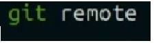
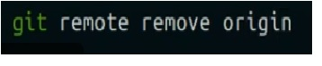
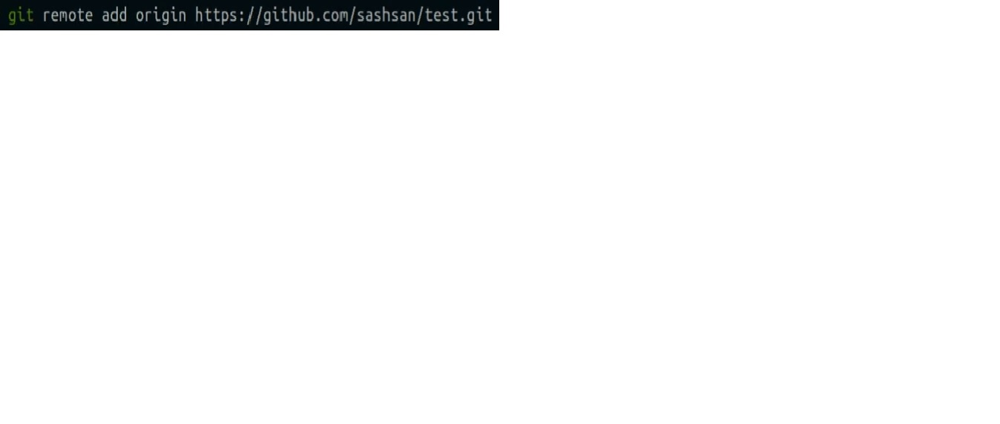
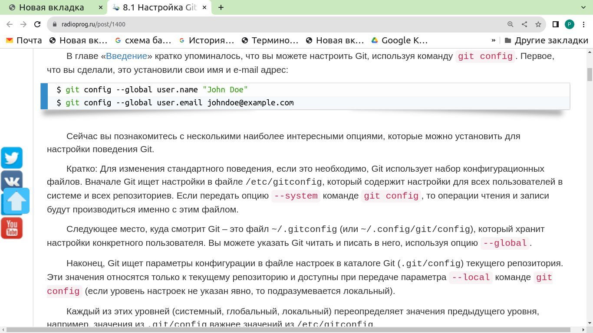
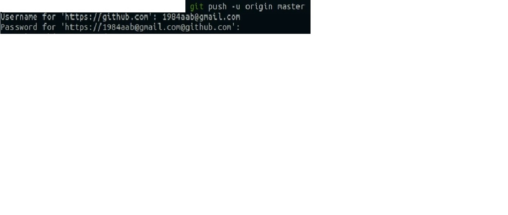
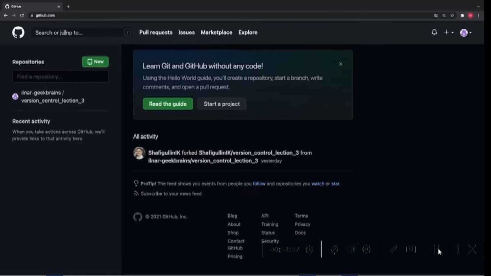
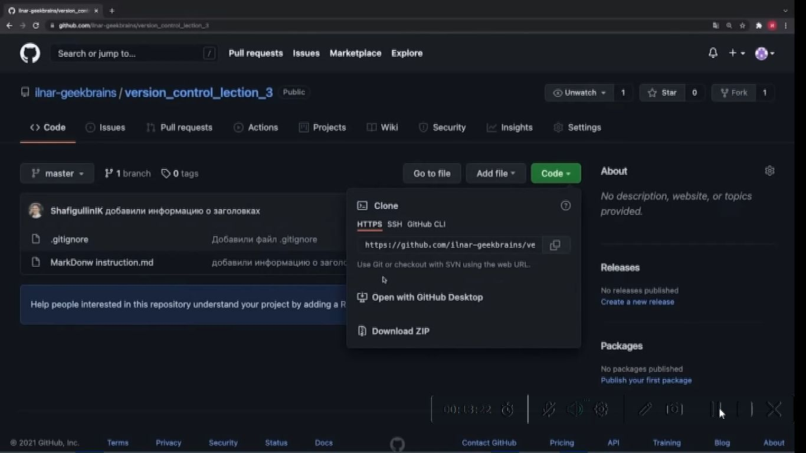
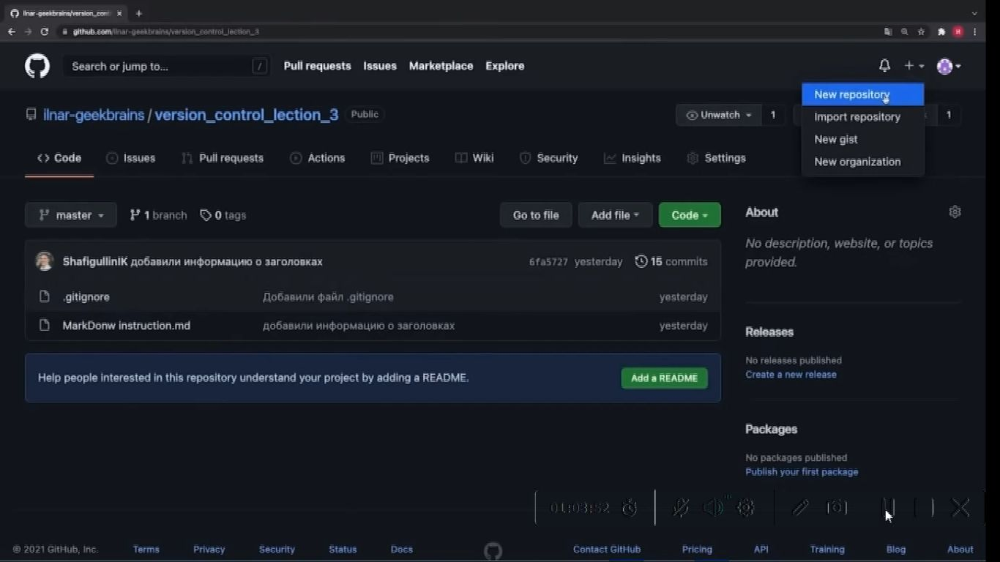
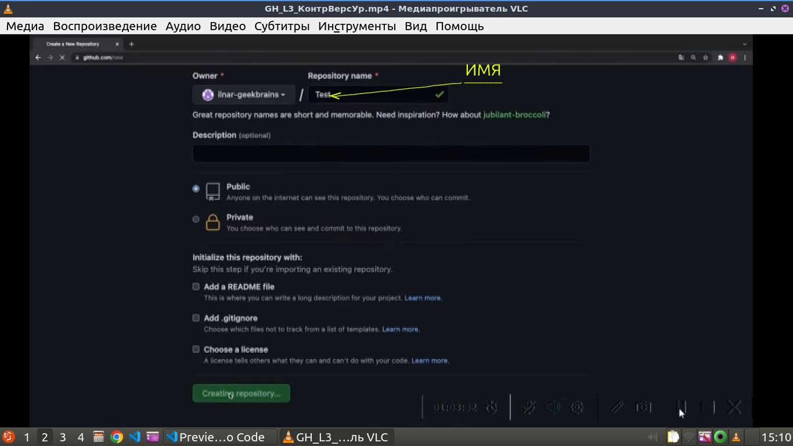
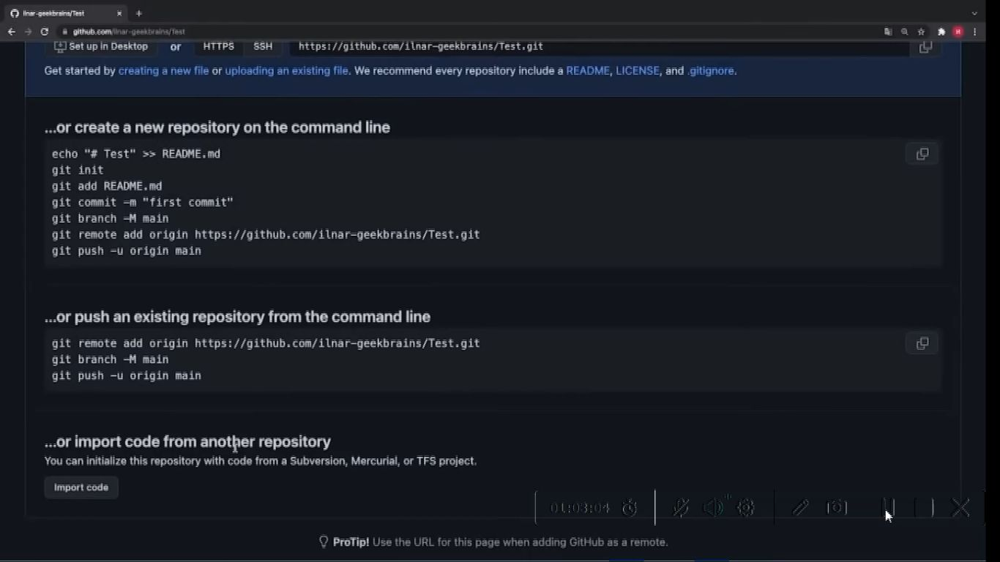

### Part1: __GH_L1_КонтрольВерсий27.mp4__
### Part2: __GH_L2_КонтрВерс.mp4__
### Part3: __GH_L3_КонтрВерсУр.mp4__
### __location information is:  Google disk/MyLocations__ 
&nbsp;&nbsp;


### Инициализировать git в текущей папке

<details>
<summary></summary>

```javascript
git init
```
</details>

### Показать версию git 
<details>
<summary></summary>

```javascript
git --version
```
</details>

### Проверить наличие реопозитория (скорее всего на GitHab?)

<details>



<summary></summary>

</details>

### Удалить репозиторий (скорее всего на GitHab?)

<details>
<summary></summary>



```javascript

```
</details>

### Пример как добавить репозиторий с GitHab

<details>
<summary></summary>



```javascript

```
</details>


###  Узнать статус файлов с точки зрения git

<details>
<summary></summary>

```javascript
git status
```
</details>

### Добавить файл в индекс отслеживания и сохранения git

<details>
<summary></summary>

```javascript
git add <file nime>
```
</details>

###  Клавиша дописывающая имя файла после введения первых символов ( от 2х и более если больше букв необходимо для идентификации)

<details>
<summary></summary>

```javascript
tab
```
</details>

###  Зафиксировать текущее состояние файлов индекса git с указанием комментария

<details>
<summary></summary>

```javascript
источник: (17-03-23) https://www.xodeptoject/Articles/457305/Basic-Git-Command-Line-Reference-for-Windows-Users

git commit -m "текст комментария"
git commit -a -m "текст комментария" Фиксирует все файлы измененные с момента последнего каммита. Не включает новые файлы.
git commit -a -mend -m "текст комментария" Добавляет все измененения в предыдгщую фиксацию и перезаписывает сообщение о фиксации новым текстом сообщения. Не включая новые файлы:
git commit -a если для lubuntu промотать вниз, далее ввести текст комментария (или удалить #, что бы сохранить нужные комменты сгенерированные автоматически с подробным описанием сохраняемых в коммит изменений), затем Ctr + s, далее для сохнения и выхода Ctr + x.
Для Windows после вввода -a прокрутить вниз, (или удалить #, что бы сохранить нужные комменты сгенерированные автоматически с подробным описанием сохраняемых в коммит изменений), нажать клавишу insert (что бы включить режим редактирования), ввести комментарий. Далее Esc для выхода из режима редактирования. После ввести в командной строке, в нижней части панели редактирования :x и затем Enter для выхода с сохранением.


Опции: -a Зафиксировать все изменения в отслеживаемых файлах с момента последней фиксации
       -v Подробный: включите различия между зафиксировынными элементами на экране сообщения о фиксации
       --amend Изменить сообщение о фиксации, связанное с самой последней фиксацией
       --amend <File_1><File_2>...<File_n> повторить прудыдущую фиксацию и включить изменения в указанные файлы. Фиксируем изменения для конкретных файлов и включает указанное сообщение о фиксации


```
</details>

###  Вызвать журнал git

<details>
<summary></summary>

```javascript
git log
```
</details>

### загрузить commit (загрузить сохраненую версию)

<details>
<summary></summary>

```javascript
ввести команду и первые 4 симовала имени commit
например: git checkout 5c2a
```
</details>

###  меняется ли состояние файла при переходе от commit к commit

<details>
<summary></summary>

```javascript
Нет. При переходе от одного commit к другому commit git показывает состояние в котором на момент созданния commit находился файл, при этом не изменяя его.
```
</details>

###  Что необходимо после загрузки commit для продолжения работы с git

<details>
<summary></summary>

```javascript
Для продолжения работы с git после загрузки commit необходимо загрузить актуальную версию,  и выполнить команду git checkout master
```
</details>


###  Какая существует команда git для сравнения сохраненных файлов и файлов изменения в которые внесены но не сохранены, при сравнении какими цветами и какие изменения демонстрируются

<details>
<summary></summary>

```javascript
git diff

-  красным цветом демонстрируются удаленные файлы
-  зеленым созданные
```
</details>


###  Как принято называть первый commit в реопозитории
<details>
<summary></summary>

```javascript
Initial commit (инишин коммит)
```
</details>


###  что необходимо сделать при первых настойках git

<details>
<summary></summary>

```javascript
Представиться git: git config <name>, затем: git config <email>
```
### например:



</details>


###  команда git выводит список имеющихся веток, указывает текущую ветку

<details>
<summary></summary>

```javascript
git branch
```
</details>


###  очистить терминал

<details>
<summary></summary>

```javascript
clear
```
</details>


###  команда создания ветки

<details>
<summary></summary>

```javascript
git branch <name>
```
</details>


###  как отмечается текущая ветка

<details>
<summary></summary>

```javascript
*
```
</details>


###  команда git на слияние определенной ветки с текущей веткой

<details>
<summary></summary>

```javascript
git merge <name branch>
```
</details>


###  команда git удалить ветку

<details>
<summary></summary>

```javascript
git branch -d <name branch>
Формат удаления: git(указывает что команда для git), branch(указывает что команда направлена 
на некоторую ветку), -d(флаг указывает на необходимость удаления), имя ветки указывает какую 
именно ветку необходимо удалить
```
</details>

###  имя файла в котором указываются игнорируемые файлы git

<details>
<summary></summary>

```javascript
.gitignor

```
</details>

###  Какие варианты разрешения конфликта возникшего при слияние веток с разными версиями 
одного и того же фрагмента предалагает выбрать git

<details>
<summary></summary>

```javascript
1. Accept Current Change (Принять вариант из текущей ветки т.е. в которую вливают ветку)
2. Accept Incoming Change (Принять вариант из вливаемой ветки)
3. Accept Both Change (Сохранить оба варианта)
4. Accept Changes (Сравнить)
```
</details>

###  команда git графического отображения журнала

<details>
<summary></summary>

```javascript
git log --graph
```
</details>


### Как запушить на GitHab

<details>
<summary></summary>



</details>

###  интернет-адрес тренажера git


<details>
<summary></summary>

```javascript
https://learngitbranching.js.org/
```
</details>

### 24) Окно поиска Git-Hab

<details>
<summary></summary>




</details>


### Вариант получения копии адреса реопозитория

<details>
<summary></summary>


</details>

###  Команда создания локальной копии реопозитория с реопозитория GitHab 

<details>
<summary></summary>

```javascript
git clone <интернет адрес реопозитория на GitHab>
```
</details>

###  Порядок создания реопозитория

<details>
<summary></summary>

1. Создать на GitHab аккаунт
2. Создать реопозиторий например нажав указателем мыши на "+" 
   и выбрать пункт меню "Новый репозиторий"



3. Присвоить репозиторию имя, можно сделать соотвествующие настройки,
либо оставить из по умолчанию.




</details>


###  Какие дальнейшие варианты после создания реопозитория предлагает GitHab

<details>
<summary></summary>


1. создать новый репозиторий через терминал и начать с ним работать
2. существующий репозиторий привязать к этому репозиторию
3. имопортировать код из другого репозитория


</details>


..) Выйти из  Vim

<details>
<summary></summary>

```javascript

источник: (17-02-2023) https://itsfoss.com 

1) Клавиша Esc, что бы выйти из режима редактировния
2.1) :q 
2.2) :q! - выход без сохранения файла
2.3) :wq - cохранить файл и выйти

2.4) :x -  при пробовании на практике, вроде выход с сохранением (надо попроверять на проктике еще)
2.5) :x! - примеч.: для VSCode Windows 10 пробовал работало,
           выход без сохрания.
2.6) :qa - закрывает все открытые файлы

2.7) Shift ZZ - сохранить и выйти
2.8) Shift ZQ - выход без сохранения


```
</details>
### ..) Дествия при сообщений типа: "Похоже, в этом репозитории запущен другой процесс Git"

<details>
<summary></summary>

```javascript

Источник: (17-03-23) https://stackoverflow.com/questions/38004148/another-git-process-seems-to-be-running-in-theis-repository

Предлогается удалить файл inlex.lock в каталоге .git или такой файл, или иной файл с этим расширением в рабочих деревьях или там же в каталоге

Например для Linukc: rm -f .git/index.lock
                     rm .git/index.lock
Например для Windows: del -f .git/index.lock
                      del .git/index.lock (это вариант пробовал работало в VSCode   Windows 10) 

```
</details>


### ..) Вызвать справку по программе разрешения конфликта

<details>
<summary></summary>

```javascript

git mergetool --tool-help

```
</details>

..) команды vimdiff

<details>

<summary></summary>

```javascript

##команды vimdiff

]c - перейти к следующему отличию 

[c - перейти к предыдущему различию 

получение do - diff (отличное от текущего), сокращенное ':diffget' 
dp - diff put (текущий для другого), сокращенный ':diffput' 

:diffupdate - повторно просканировать файлы на наличие различий 
:diffthis - получить разницу файлов в буферах (из обычного режима) 
:diffoff - возврат в нормальный режим 
zo - открывать свернутый текст 
zc - закрыть свернутый текст 

Ctrl + W Ctrl + W - переключиться на следующее окно 
:ls - показать информацию о Windows 


:x либо :wq или :w или :wqa (сохранить и выйти, рабочим является вариант из указанных как подозреваю в зависимости от ОС, последняя команда - :wqa вроде сохранить и выйти с закрытием всех окон)

Ctrl + r (базовый калькулятор, примерно так: Ctrl+r '=2+2' ENTER)

diffoff - делает буфер или окно неактивным

:bufdo (выполнить команду для всех буферов, например: :bufdo diffoff)


:diffget LO - выбрать вариант при слиянии из локальной версии

:diffget RE - выбрать вариант при слиянии из удаленного репозитория

:diffget BA - выбрать вариант при слиянии из быза (если я правильно понял, предыдущую сохраненную последнюю версию перед данным изменением)

ссылка на справочник: https://vimhelp.org/windows.txt.html#%3Abufdo

```
</details>

..) Как "выпилить" файл из истории коммитов (например кривой, или больше 100 мб - такие не принимае github, или с пиватными данными - пароль и т.п.)

<details>
<summary></summary>

```javascript
01.06.2023
https://qna.habr.com/q/865863

ПРИМЕР 1
dyuriev Денис Юрьев @dyuriev
A posteriori
Отвечу чуть подробнее чем спрашиваете:

Конкретный файл (www/video/route.mp4):

git filter-branch --force --index-filter 'git rm --cached --ignore-unmatch www/video/route.mp4 ' --prune-empty --tag-name-filter cat -- --all


Файл по маске (*.mp4):

git filter-branch --force --index-filter 'git rm --cached --ignore-unmatch "*.mp4" ' --prune-empty --tag-name-filter cat -- --all


Директорию (www/video):

git filter-branch --force --index-filter 'git rm --cached --ignore-unmatch www/video -r' --prune-empty --tag-name-filter cat -- --all

Данный способ не оптимальный, но универсальный - проверит всю историю коммитов и выпилит из коммитов данные файлы/каталоги и перепишет все что дальше

Пуш форсом отправляем все ветки в репозиторий
git push origin --force --all

не забываем сообщить другим разрабам что надо сделать git reset --hard origin/...

Warning: опробуйте сначала на тестовом репозитории (склонируйте текущий куда нибудь и потренируйтесь). Не хочу чувствовать себя виноватым, если вы выпилите что-то исторически-ценное

ПРИМЕР2:

toxa82 toxa82 @toxa82
Удаление файла passwords.txt изо всех коммитов
git filter-branch --tree-filter 'rm -f passwords.txt' HEAD

Подробнее в пункте "Удаление файла из каждого коммита"
Учтите что вы меняете историю и git push вам не разрешат сделать, надо будет делать git push -f. Остальные в команде должны будут сделать
git fetch && git checkout master && git reset --hard origin/master


ЗАМЕЧАНИЕ: по другим источникам в последнее время ГИТ рекомендует использовать filter-repo (вместо вышеуказанного кода  filter-branch), которые могут отличаться по синатксису. На момент внесения текущей инфы рабочий синтаксис с  "filter-repo" в нете не нашелся. Использован "filter-branch". Вроде как-то срослось. Возможные косяки данного действия будут выявленны может быть и позже в ходе дальнейшего использования репозитория. Надо будет посмотреть.


```
</details>
### ..) .......................................

<details>
<summary></summary>

```javascript
..........................
```
</details>
### ..) .......................................

<details>
<summary></summary>

```javascript
..........................
```
</details>
### ..) .......................................

<details>
<summary></summary>

```javascript
..........................
```
</details>
### ..) .......................................

<details>
<summary></summary>

```javascript
..........................
```
</details>
### ..) .......................................

<details>
<summary></summary>

```javascript
..........................
```
</details>

### ..) .......................................

<details>
<summary></summary>

```javascript
..........................
```
</details>

### A1)  __git --version__
### A2) __git init__
### A3) __git status__
### A4) __git add <file nime>__
### A5) __tab__
### A6) __git commit -m "текст комментария"__
### A7) __git log__