-) Плюсы Java

<details>

<summary></summary>

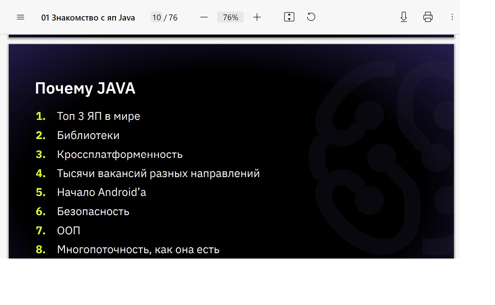

```javascript


```


</details>


-) План занятия 

<details>

<summary></summary>

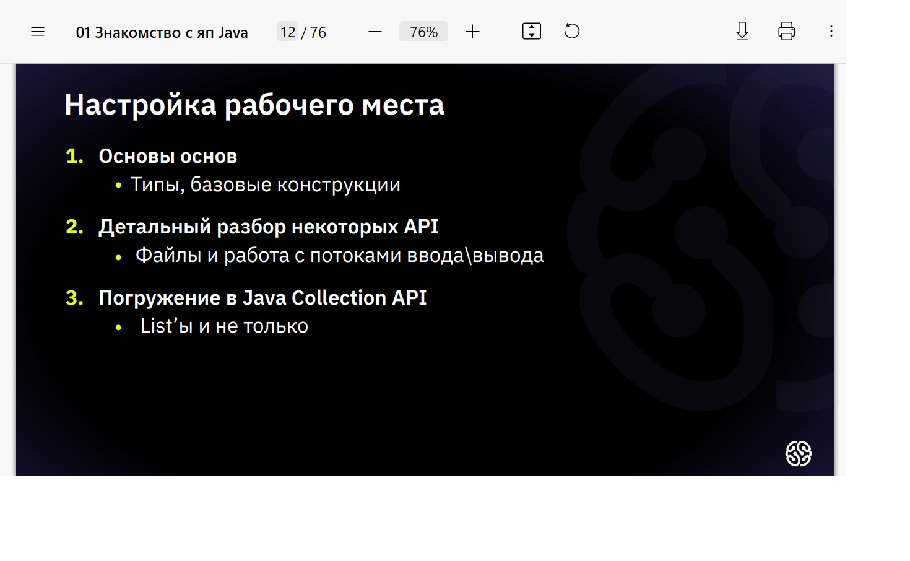

```javascript


```


</details>


-) Перевод страницы настройки

<details>

<summary></summary>

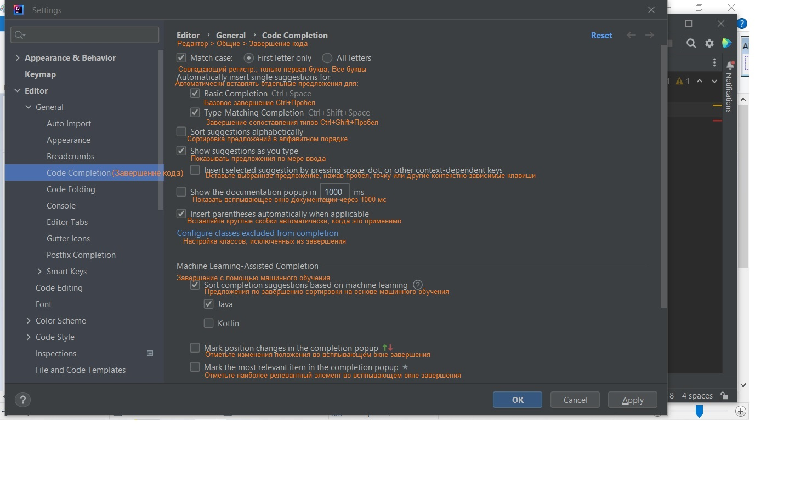

```javascript


```


</details>


-) Error1

<details>

<summary></summary>

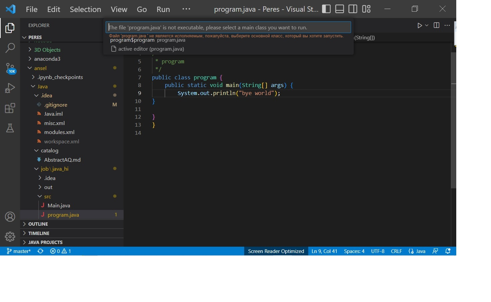

```javascript


```


</details>


-) Снипет создания класса

<details>

<summary></summary>


```javascript

сверху в низ второй


```
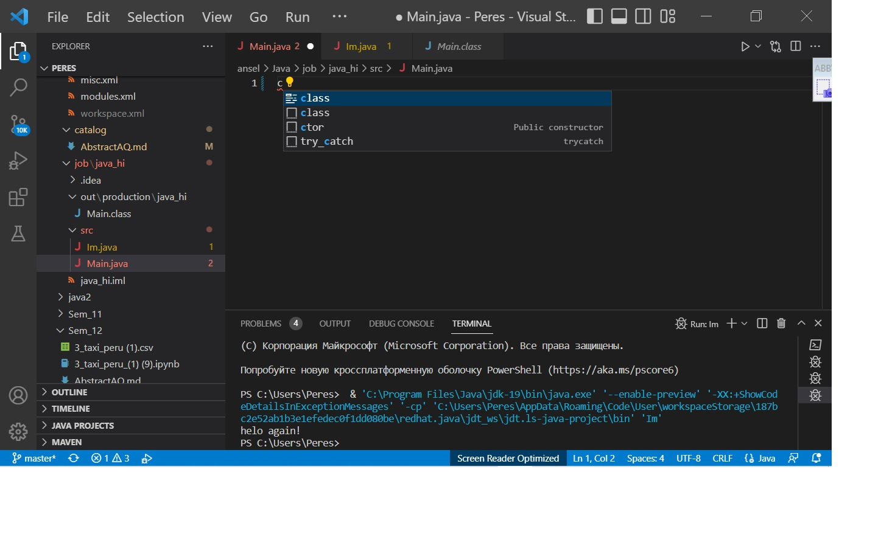


</details>


-) Снипет создания точки входа 

<details>

<summary></summary>


```javascript

Первый сверху


```
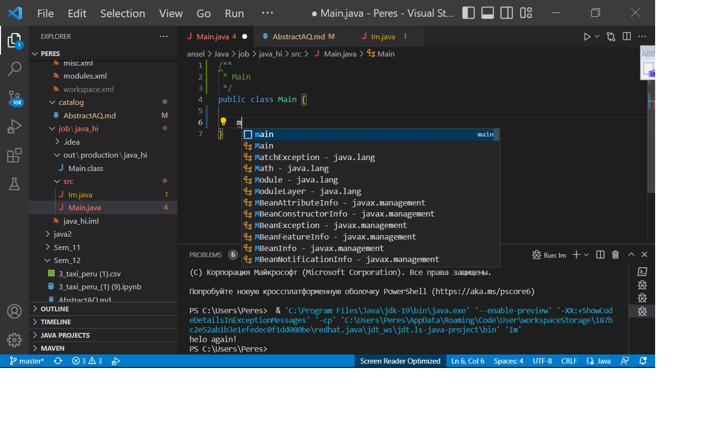


</details>


-) Снипет создания метода принт елэн - System.out.println();

<details>

<summary></summary>


```javascript

Верхний.


```


</details>


-) На какие две большие группы делятся типы данных java

<details>

<summary></summary>


```javascript

two_groups:

1. ссылочные, к которым относятся классы (например к интерфесам)

2. примитивные, логический тип данных, множество целочисленных данных, вещественные типы данных (float, double), символьный тип данных.


```

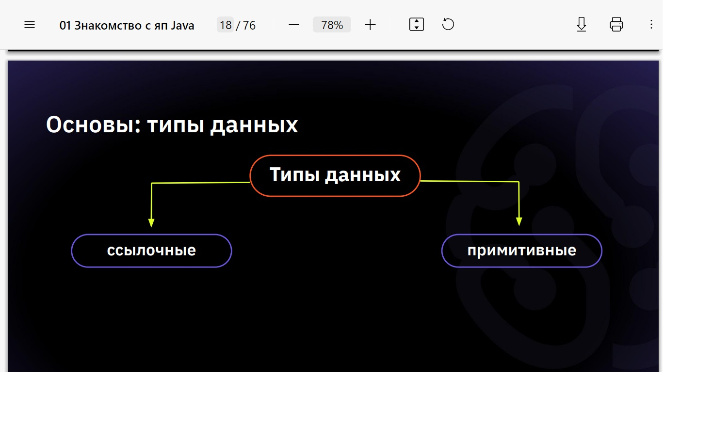

</details>


-) Создание переменной 

<details>

<summary></summary>


```javascript

Объявление переменной.

Указывается: 1. тип данных, 2. индефикатов (имя) закрывающийся точкой с запятой (;)

Инициализация переменно.

Указывается: 1. индефикатор, 2. оператов присваивания, 3. значение переменной соотвествуеющее типу данных указанному при объявлении переменной


```

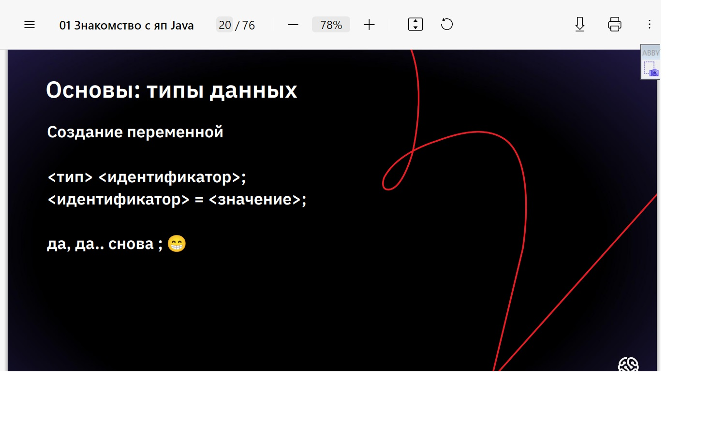

</details>


-) Целочисленные типы данных 

<details>

<summary></summary>


```javascript

class Program
{
public static void main(String[] args) { 
    short age = 10; 
    int salary = 123456;
    System.out.printin(age);        //10 
    System.out.println(salary);     //12
    }
}


```

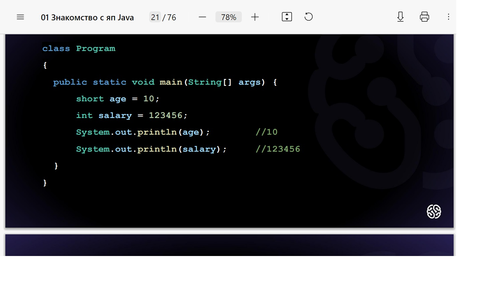

</details>


-) Вещественные числа 

<details>

<summary></summary>


```javascript

class Program
{
    public static void main(String[] args) { 
        float e = 2.7f;
        double pi = 3.1415;
        System.out.println(e); // 2.7 
        System.out.println(pi); // 3.1415
    }
}

```


</details>


-) Тип данных char (определяющий отдельных символ)

<details>

<summary></summary>


```javascript

class Program
{
    public static void main(String[] args) {
        char ch = '1'; 
        System.out.println(Character.isDigit(ch));  // true 
        ch = 'a';      
        System.out.println(Character.isDigit(ch));  // false
    }
} 


```


</details>


-) Тип данных  boolean

<details>

<summary></summary>


```javascript

public class Program {
    public static void main(String[] args) { 
        boolean flagl = 123 <= 234; 
        System.out.println(flagl);  // true 
        boolean flag2 = 123 >= 234 || flagl; 
        System.out.println(flag2);  // true 
        boolean flag3 = flagl ^ flag2; 
        System.out.println(flag3);  // false  
    }
}  

```


</details>


-) Строки

<details>

<summary></summary>


```javascript

public class Program {
    public static void main(String[] args) {
         String msg ="Hello world";

        System.out.println (msg) ;    //   Hello   world
    }
}


```


</details>


-) Неявная типизация

<details>

<summary></summary>


```javascript

public class Program {
    public static void main(String[] args) { 
        var a = 123;
        System.out.println(a);  // 123 
        var d = 123.456; 
        System.out.println(d);  // 123.456
    }
}


```


</details>


-) Не явня типизация

<details>

<summary></summary>


```javascript

public  class   Program   {
    public  static  void main(String[]   args)    {
        var  a  = 123;
        System.out.println(a);      //   123
        var  d =  123.456;
        System.out.println(d);      //   123.456
        System.out.println(getType(a));      //   Integer
        System.out.println(getType(d));      //  Double
        d =  1022;
        System.out.println(d);  // 1022
        //d = "mistake";
        //error: incompatible types:
        //String cannot be converted to double
    }
    static String getType(Object o){
        return o.getClass().getSimpleName();
    }
}

```


</details>


-) Классы-обертки

<details>

<summary></summary>

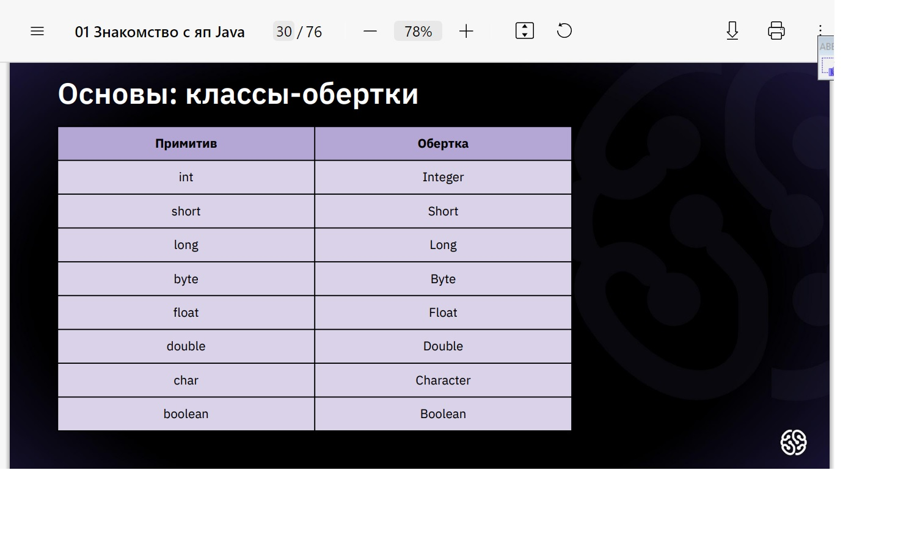

```javascript


```

Используется для получения доступа к большему фнукционалу
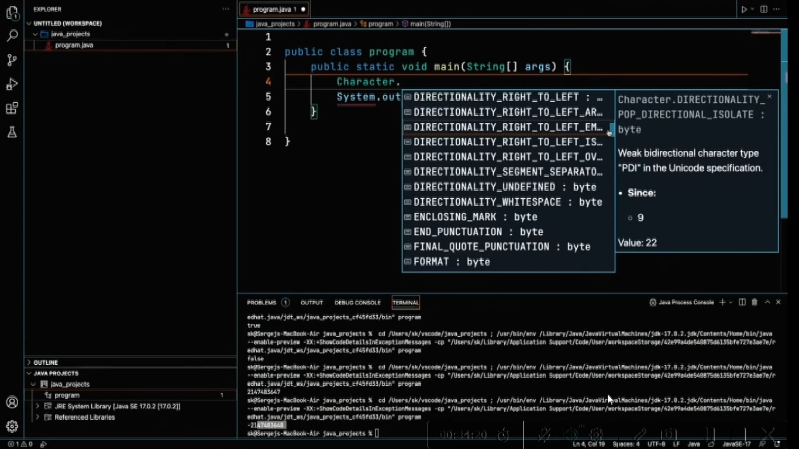

</details>


-) Получить доступ к определенному символу переменной String

<details>

<summary></summary>


```javascript

public class program {
    public static void main(String[] args) { 
        String s ="qwer";
        s.charAt(1)
        System.out.println(Integer.MlN_VALUE);
    }
}


```


</details>


-) Узнать длину переменной String

<details>

<summary></summary>


```javascript

public class program {
    public static void nain(String[] args) {
        String s ="qwer";
        s.length()
        System.out.println(Integer.MIN_VALUE);
     }
}

```


</details>


-) Операции java

<details>

<summary></summary>

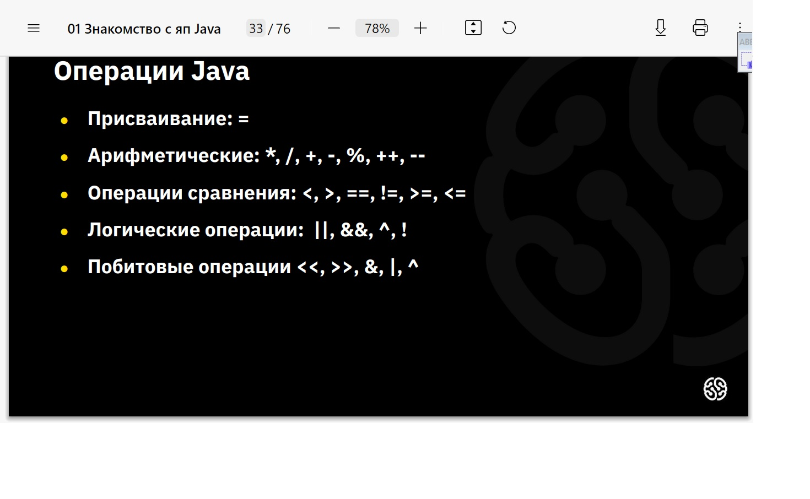

```javascript

пресфиксный инкримент ++а (имеет приоритет: ++)
постфисный инкримент а++ (имеет приоритет: а )


```


</details>


-) По-битовое: или

<details>

<summary></summary>

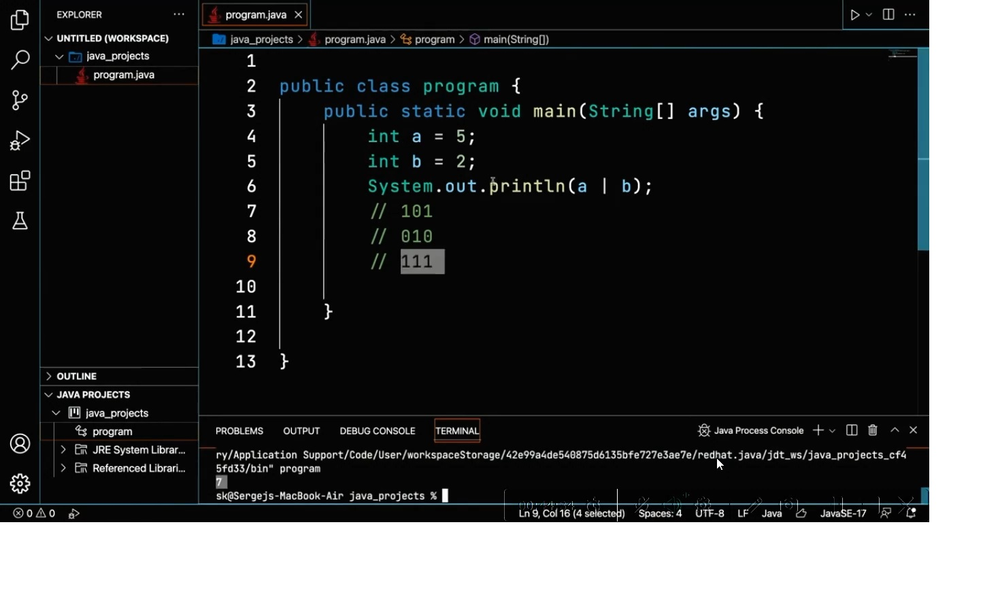

```javascript

-


```


</details>


-) По-битовое: и 

<details>

<summary></summary>

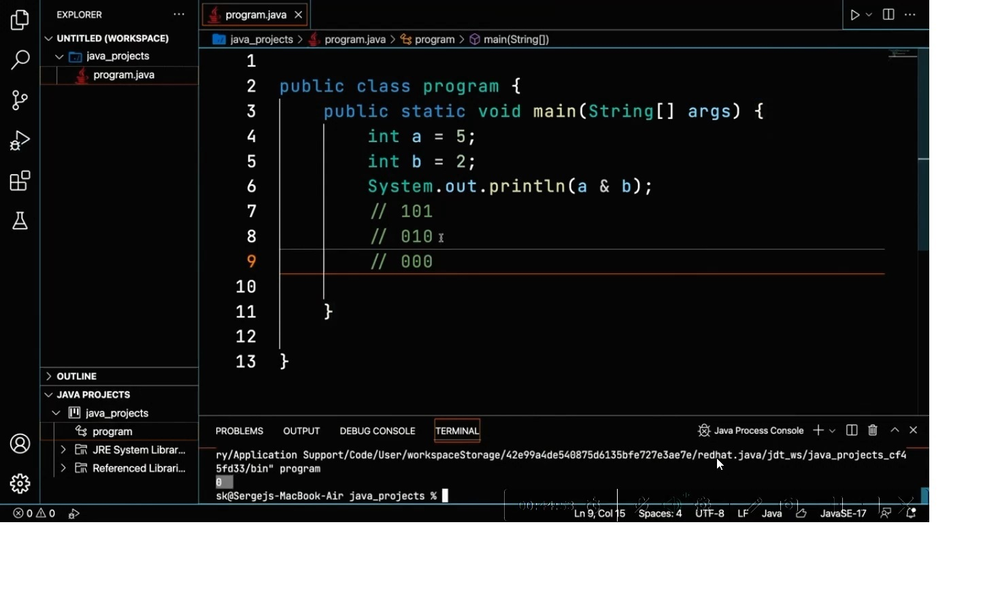

```javascript

-


```


</details>


-) Разделительное по-битовое: или

<details>

<summary></summary>

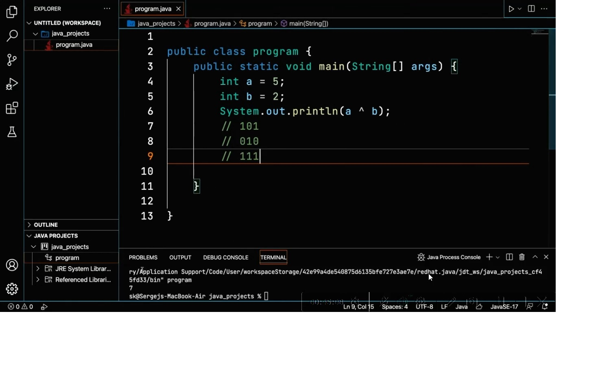

```javascript

-


```


</details>


-) Операция по-битового сдвига

<details>

<summary></summary>


```javascript

public class program {
    public static void main(String[] args) {
    
        int a = 18;
        // 10010
        //a = a « 1;
        System.out.println(a >> 1);
        // 1001 (результат 9)

    }
}


```


</details>


-) - 

<details>

<summary></summary>


```javascript

public class program {
    public static void main(Stning[] args) {
        String s = "qwwl"; // 4, 0 ..3 
        //boolean  b  =  s.length()  >=   5   &  s.charAt(4) = '1''
        boolean  b  =  s.length()   >=   5  &&  s.charAt(4)   = '1';

    System.out.println(b);

    }

}
// работает так как операции && (ускоренного вывода) проверив первую часть предложения и определив false, выводит результатат т.к. он в любом случае уже отрицательный не проверяя дальше следующую часть где содержиться ошибка.

public class program {
    public static void main(Stning[] args) {
        String s = "qwwl"; // 4, 0 ..3 
        //boolean  b  =  s.length()  >=   5   &  s.charAt(4) = '1''
        boolean  b  =  s.length()   >=   5  &  s.charAt(4)   = '1';

    System.out.println(b);

    }

}
// не работает так как операции & проверив первую часть предложения и определив false, выводит не смотря на отрицательные незультат проверяет и вторую часть которая создает ошибку
```

Такая же особенность у знаков разделительной дезьюнкции || и | (первая быстрая, а вторая проверяет все условия не зависимо от результатов первой часть выражения)

</details>


-) - 

<details>

<summary></summary>


```javascript

-


```


</details>


-) - 

<details>

<summary></summary>


```javascript

-


```


</details>


-) - 

<details>

<summary></summary>


```javascript

-


```


</details>


-) - 

<details>

<summary></summary>


```javascript

-


```


</details>


-) - 

<details>

<summary></summary>


```javascript

-


```


</details>


