-) Плюсы Java

<details>

<summary></summary>

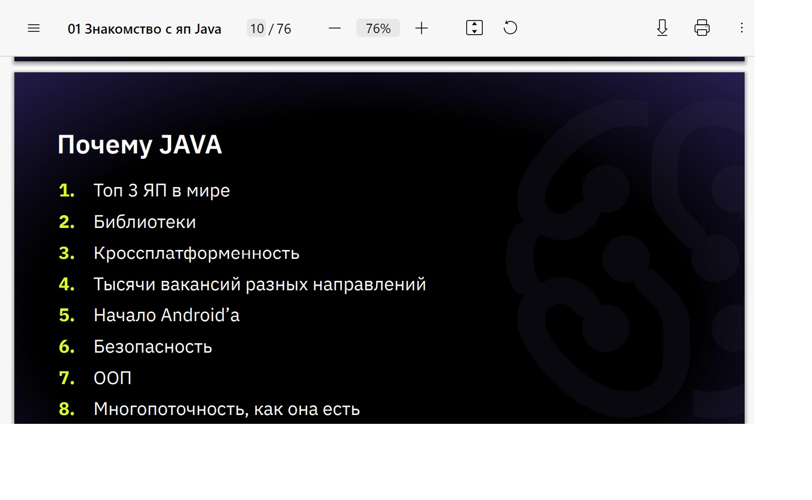

```javascript


```


</details>


-) План занятия 

<details>

<summary></summary>

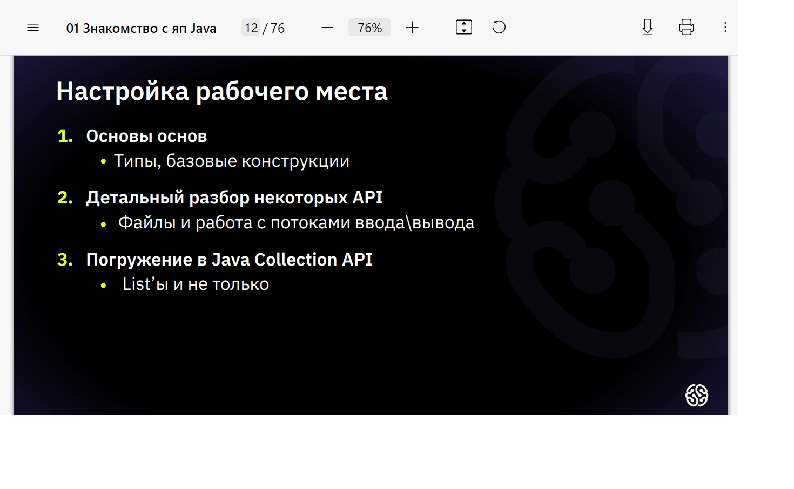

```javascript


```


</details>


-) Перевод страницы настройки

<details>

<summary></summary>

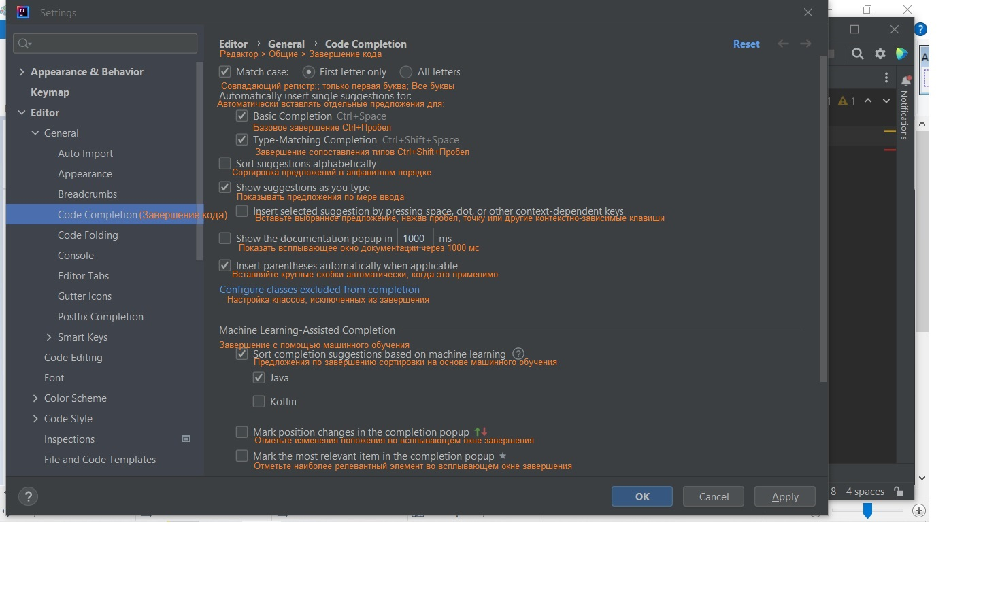

```javascript


```


</details>


-) Error1

<details>

<summary></summary>

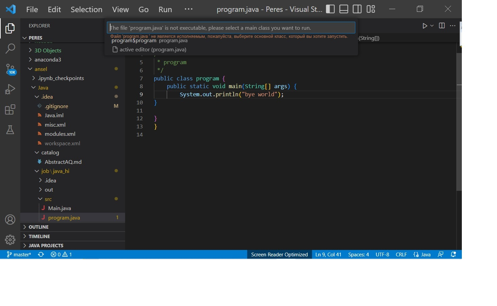

```javascript


```


</details>


-) Снипет создания класса

<details>

<summary></summary>


```javascript

сверху в низ второй


```
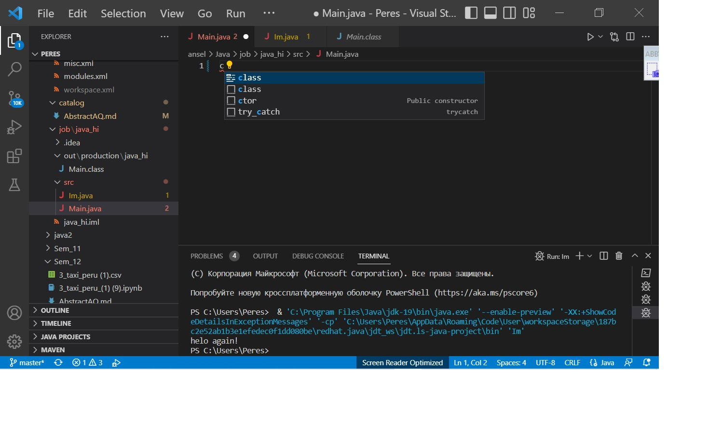


</details>


-) Снипет создания точки входа 

<details>

<summary></summary>


```javascript

Первый сверху


```
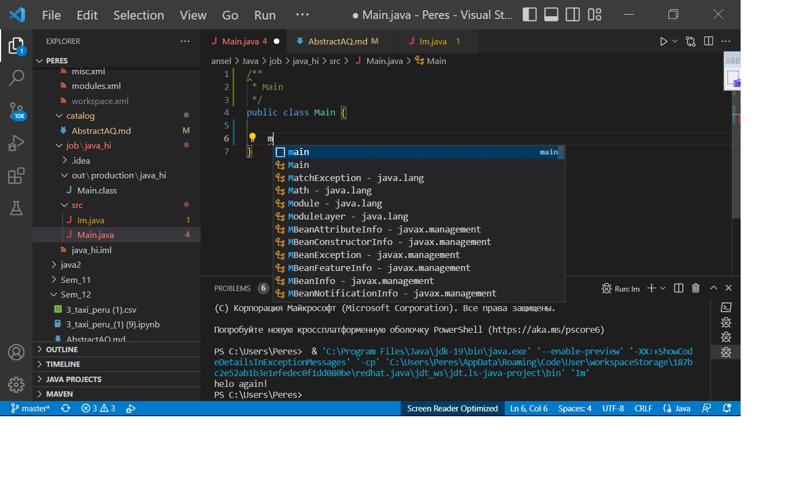


</details>


-) Снипет создания метода принт елэн - System.out.println();

<details>

<summary></summary>


```javascript

Верхний.


```


</details>


-) На какие две большие группы делятся типы данных java

<details>

<summary></summary>


```javascript

two_groups:

1. ссылочные, к которым относятся классы (например к интерфесам)

2. примитивные, логический тип данных, множество целочисленных данных, вещественные типы данных (float, double), символьный тип данных.


```

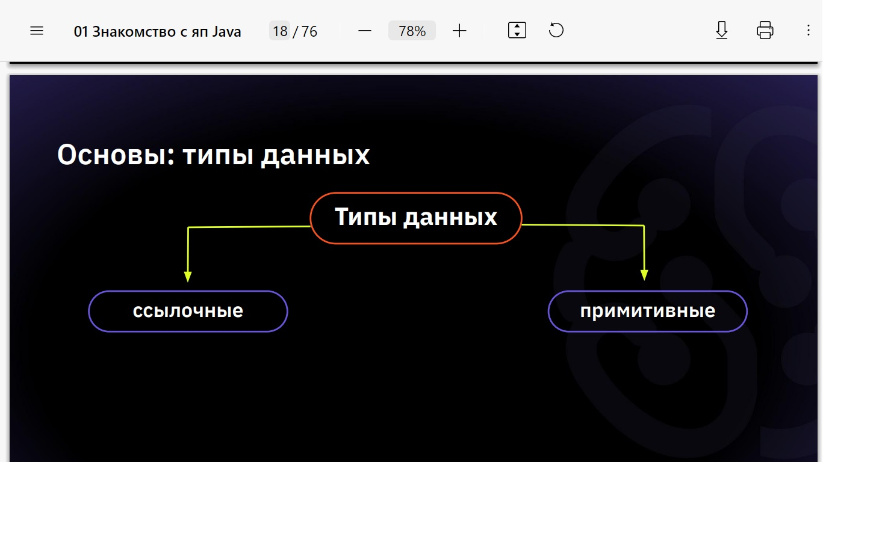

</details>


-) Создание переменной 

<details>

<summary></summary>


```javascript

Объявление переменной.

Указывается: 1. тип данных, 2. индефикатов (имя) закрывающийся точкой с запятой (;)

Инициализация переменно.

Указывается: 1. индефикатор, 2. оператов присваивания, 3. значение переменной соотвествуеющее типу данных указанному при объявлении переменной


```

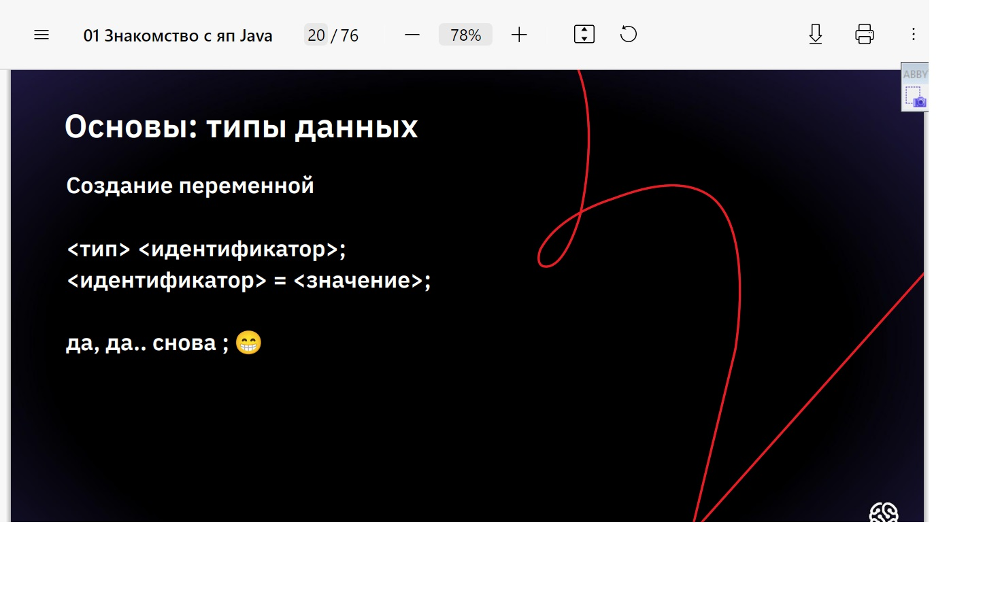

</details>


-) Целочисленные типы данных 

<details>

<summary></summary>


```javascript

class Program
{
public static void main(String[] args) { 
    short age = 10; 
    int salary = 123456;
    System.out.printin(age);        //10 
    System.out.println(salary);     //12
    }
}


```

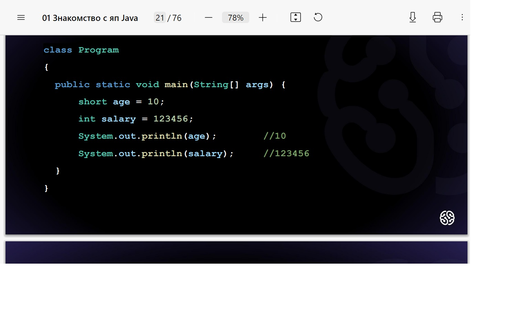

</details>


-) Вещественные числа 

<details>

<summary></summary>


```javascript

class Program
{
    public static void main(String[] args) { 
        float e = 2.7f;
        double pi = 3.1415;
        System.out.println(e); // 2.7 
        System.out.println(pi); // 3.1415
    }
}

```


</details>


-) Тип данных char (определяющий отдельных символ)

<details>

<summary></summary>


```javascript

class Program
{
    public static void main(String[] args) {
        char ch = '1'; 
        System.out.println(Character.isDigit(ch));  // true 
        ch = 'a';      
        System.out.println(Character.isDigit(ch));  // false
    }
} 


```


</details>


-) Тип данных  boolean

<details>

<summary></summary>


```javascript

public class Program {
    public static void main(String[] args) { 
        boolean flagl = 123 <= 234; 
        System.out.println(flagl);  // true 
        boolean flag2 = 123 >= 234 || flagl; 
        System.out.println(flag2);  // true 
        boolean flag3 = flagl ^ flag2; 
        System.out.println(flag3);  // false  
    }
}  

```


</details>


-) Строки

<details>

<summary></summary>


```javascript

public class Program {
    public static void main(String[] args) {
         String msg ="Hello world";

        System.out.println (msg) ;    //   Hello   world
    }
}


```


</details>


-) Неявная типизация

<details>

<summary></summary>


```javascript

public class Program {
    public static void main(String[] args) { 
        var a = 123;
        System.out.println(a);  // 123 
        var d = 123.456; 
        System.out.println(d);  // 123.456
    }
}


```


</details>


-) Не явня типизация

<details>

<summary></summary>


```javascript

public  class   Program   {
    public  static  void main(String[]   args)    {
        var  a  = 123;
        System.out.println(a);      //   123
        var  d =  123.456;
        System.out.println(d);      //   123.456
        System.out.println(getType(a));      //   Integer
        System.out.println(getType(d));      //  Double
        d =  1022;
        System.out.println(d);  // 1022
        //d = "mistake";
        //error: incompatible types:
        //String cannot be converted to double
    }
    static String getType(Object o){
        return o.getClass().getSimpleName();
    }
}

```


</details>


-) Классы-обертки

<details>

<summary></summary>

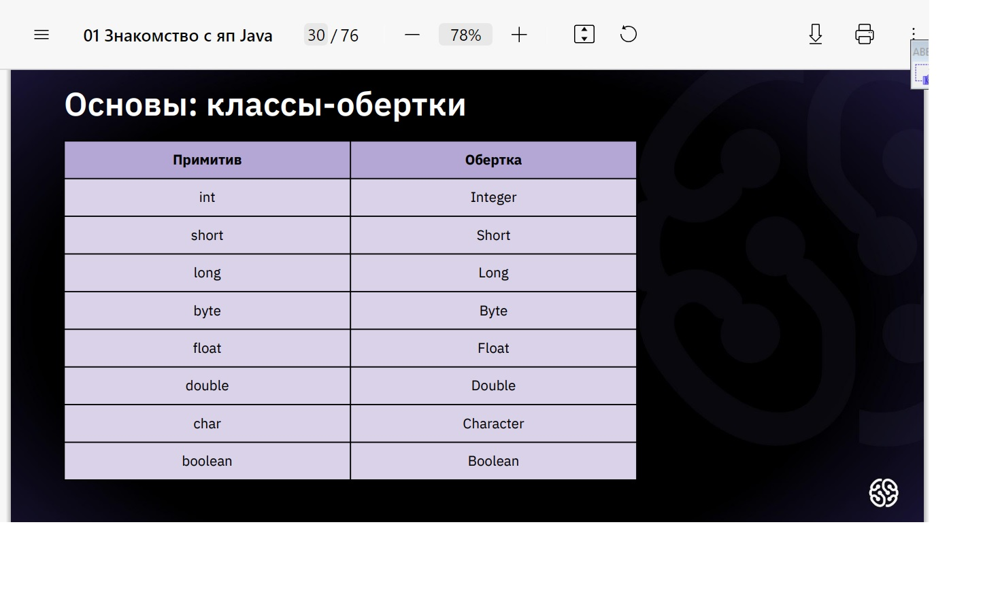

```javascript


```

Используется для получения доступа к большему фнукционалу
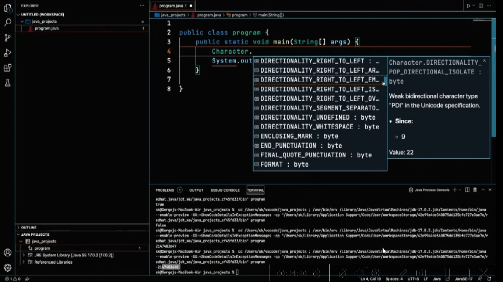

</details>


-) Получить доступ к определенному символу переменной String

<details>

<summary></summary>


```javascript

public class program {
    public static void main(String[] args) { 
        String s ="qwer";
        s.charAt(1)
        System.out.println(Integer.MlN_VALUE);
    }
}


```


</details>


-) Узнать длину переменной String

<details>

<summary></summary>


```javascript

public class program {
    public static void nain(String[] args) {
        String s ="qwer";
        s.length()
        System.out.println(Integer.MIN_VALUE);
     }
}

```


</details>


-) Операции java

<details>

<summary></summary>

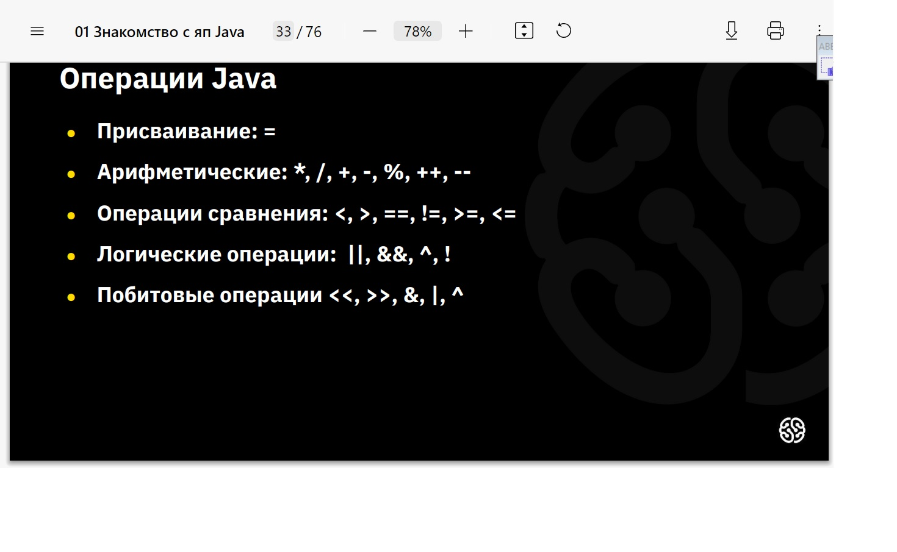

```javascript

пресфиксный инкримент ++а (имеет приоритет: ++)
постфисный инкримент а++ (имеет приоритет: а )


```


</details>


-) По-битовое: или

<details>

<summary></summary>

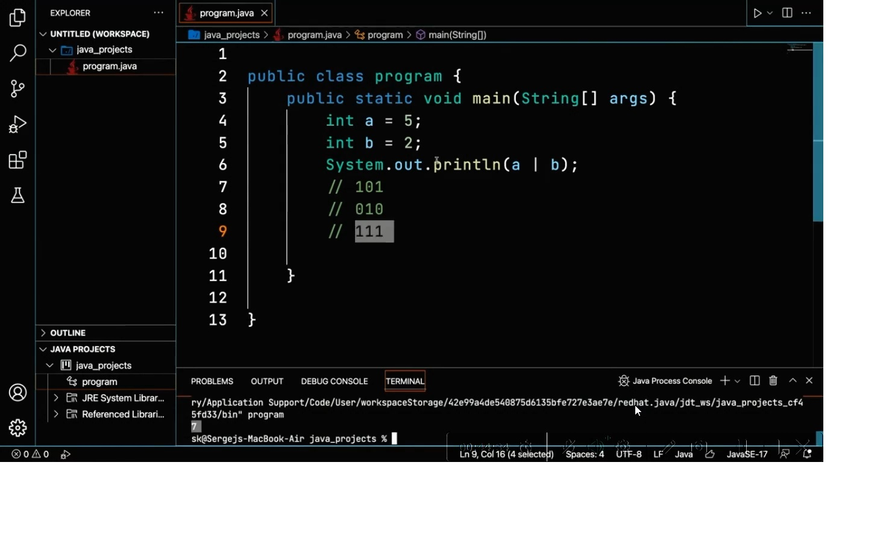

```javascript

-


```


</details>


-) По-битовое: и 

<details>

<summary></summary>

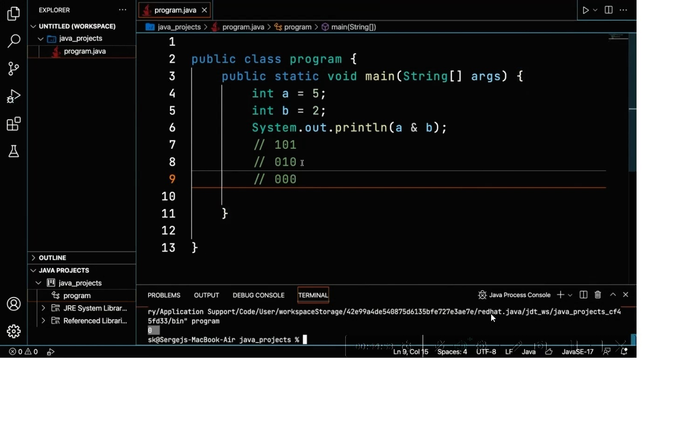

```javascript

-


```


</details>


-) Разделительное по-битовое: или

<details>

<summary></summary>

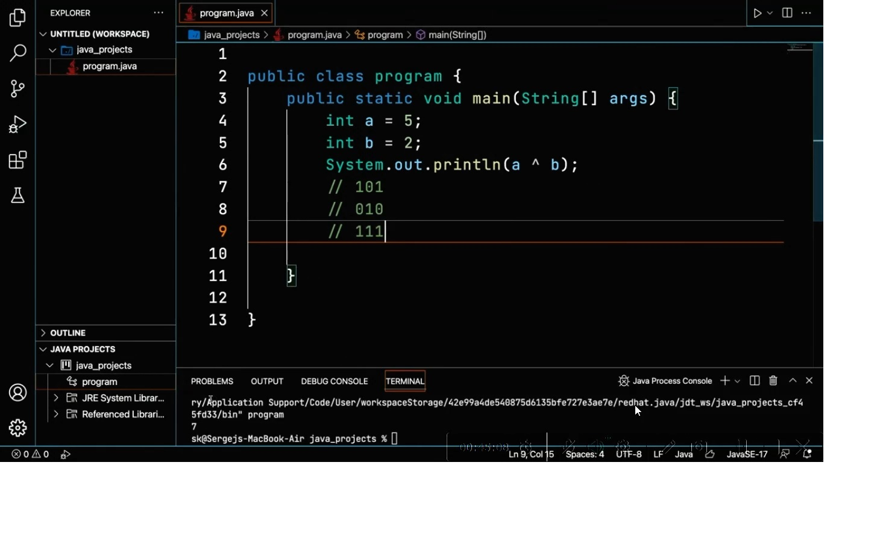

```javascript

-


```


</details>


-) Операция по-битового сдвига

<details>

<summary></summary>


```javascript

public class program {
    public static void main(String[] args) {
    
        int a = 18;
        // 10010
        //a = a « 1;
        System.out.println(a >> 1);
        // 1001 (результат 9)

    }
}


```


</details>


-) Отличия в работе между & и &&,  | и || 

<details>

<summary></summary>


```javascript

public class program {
    public static void main(Stning[] args) {
        String s = "qwwl"; // 4, 0 ..3 
        //boolean  b  =  s.length()  >=   5   &  s.charAt(4) = '1''
        boolean  b  =  s.length()   >=   5  &&  s.charAt(4)   = '1';

    System.out.println(b);

    }

}
// работает так как операции && (ускоренного вывода) проверив первую часть предложения и определив false, выводит результатат т.к. он в любом случае уже отрицательный не проверяя дальше следующую часть где содержиться ошибка.

public class program {
    public static void main(Stning[] args) {
        String s = "qwwl"; // 4, 0 ..3 
        //boolean  b  =  s.length()  >=   5   &  s.charAt(4) = '1''
        boolean  b  =  s.length()   >=   5  &  s.charAt(4)   = '1';

    System.out.println(b);

    }

}
// не работает так как операции & проверив первую часть предложения и определив false, выводит не смотря на отрицательные незультат проверяет и вторую часть которая создает ошибку
```

Такая же особенность у знаков разделительной дезьюнкции || и | (первая быстрая, а вторая проверяет все условия не зависимо от результатов первой часть выражения)

</details>


-) Одномерные массивы

<details>

<summary></summary>


```javascript

package java2.job2;

/**
 Массивы
 Одномерные
 */
public class program {

    public static void main(String[] args) {
        int[] arr = new int[10];
        System.out.println(arr.length); //10

        arr = new int[] {1, 2, 3, 4, 5};
        System.out.println(arr.length); //5

        System.out.println(arr[3]); // посмотреть третий элемент массива

        arr[3] = 12; // присвоить значение третьему элементу
        System.out.println(arr[3]);
    }
}


```


</details>

-) Передача массива в качестве аргумента функции (методу)

<details>

<summary></summary>

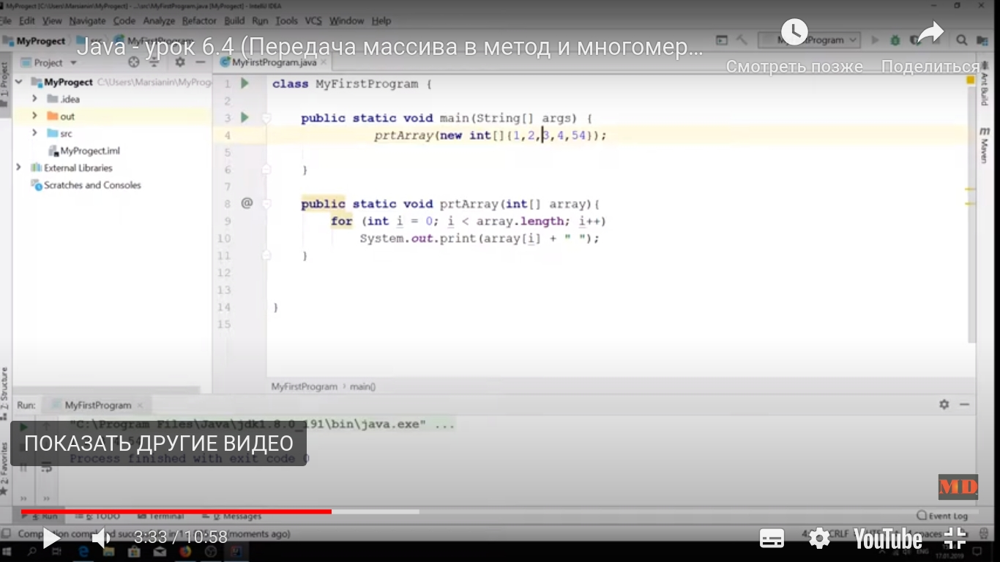

вариант1:

```javascript

package Seminar1;
import java.util.Scanner;
public class sem1_task33 {public static void main (String[]args) {
	prtArray(new int [] {1, 2, 3, 4, 54});
	
	}
public static void prtArray (int[]array) {
	for (int i = 0; i < array.length; i++)
	System.out.print(array[i] + " ");
}


}	


```
вариант2:

```javascript
public class sem_task333 {

    public static void main(String[] args) {
        int [] arr = {5, 6, 7, 10, 15};
        check(arr); 
    }

private static void check(int [] a) {
    for (int i = 0; i < a.length; i++)
        System.out.print(a[i] + " ");
        System.out.println();
}
}


```

вариант3 :

```javascript

public class sem_task333 {

    public static void main(String[] args) {
        check(new int[] {1, 2, 3, 44}); 
    }

private static void check(int [] a) {
    for (int i = 0; i < a.length; i++)
        System.out.print(a[i] + " ");
        System.out.println();
}
}


```
вариант4:

```javascript

public class sem_task333 {

    public static void main(String[] args) {
        check(1, 2, 3, 444); 
    }

private static void check(int... a) {
    for (int i = 0; i < a.length; i++)
        System.out.print(a[i] + " ");
        System.out.println();
}
}

```


</details>

-) Преобразование массива в список (сырой метод int не срабатывает - но работает к примеру Integer (класс обертки))

<details>

<summary></summary>


```javascript
package Java1.job1.practical_task;
import java.util.Arrays;
import java.util.List;
public class task2 {
    public static void main(String[] args) {
        int array[] = {1, 0, 3, 4, 9};
        check(array);
    }

 private static void check(int[]arr){
 List<int[]> list = Arrays.asList(arr); // преобразование массива в список

 
 }

```

</details>


-) иттерация списка V-1 (сырой метод, чего-то не хватает)

<details>

<summary></summary>


```javascript
package Java1.job1.practical_task;
import java.util.Arrays;
import java.util.List;
public class task2 {
    public static void main(String[] args) {
        int array[] = new int [1000];
        for(int i=0; i < array.length; i++)
        check(array);
    }

 private static void check(int[]arr){
 List<int[]> list = Arrays.asList(arr); // преобразование массива в список
 for(int i = 0; i < list.size(); i++)
 System.out.println(list.get(i) + " ");// иттерация 1 вариант.
    
 }
 
 }

      

```

</details>


-) преобразование массива в список и иттерация списка V-2 и V-3 (рабочий вариант)
<details>

<summary></summary>


```javascript

package Java1.job1.practical_task;
import java.util.Arrays;
import java.util.List;
public class task2 {
    public static void main(String[] args) {
        Integer array[] = new Integer [1000];
        for(int i=0; i < array.length; i++){
        array[i] = i;
        }
        check(array);
    }
 private static void check(Integer[]arr){
 List<Integer> list = Arrays.asList(arr); // преобразование массива в список
 for (Integer item : list ){
 System.out.println(item); // иттерация вариант 2
}
}

}

```
Вариант 3

```javascript
import java.util.Arrays;
import java.util.List;
public class task_2 {
    public static void main(String[] args) {
        Integer array[] = new Integer [1000];
        for(int i=0; i < array.length; i++){
        array[i] = i;
        }
        check(array);
    }
 private static void check(Integer[]arr){
 List<Integer> list = Arrays.asList(arr); // преобразование массива в список
 for (int i = 0; i < list.size(); i++ ){
 System.out.println(list.get(i)); // иттерация вариант 3
}
}
}

```

</details>


-) Работа с массивами. Решение задачи. Ввод длины массива с клавиатуры. Создание массива указанной длины. Заполнение созданного массива в цикле for рандомными числами в диапазоне от 0 до 1.

<details>

<summary></summary>


```javascript

package Seminar1;
import java.util.Scanner;
public class sem1_task3 {
    public static void main(String[] args) {
        Scanner iScanner = new Scanner (System.in);
        System.out.println("Введите колличество элементов массива: ");
        int countt = iScanner.nextInt();
        int[] arr = new int[countt];
        for (int i = 1; i <= arr.length; i++) {
          arr[i] = (int) ( Math.random() * 2 );
          int ci =+ arr[i]; 
        System.out.println(ci);     
        }
      
    }
}

```


</details>


-) Многомерные массивы

<details>

<summary></summary>


```javascript

/**
 Массивы
 многомерные
 */
public class Program {

    public static void main(String[] args) {
        int[] arr[] = new int[3][5]; // Массив будет иметь три строки и пять столбцов
        for (int[] line : arr){
            for (int item : line) {
                System.out.println(item);
            }
            System.out.println(); 
        }                   
    }
}

```


</details>


-)Массивы массивов 

<details>

<summary></summary>


```javascript

/**
 Массивы
 массивов
 */
public class Program {

    public static void main(String[] args) {
        int[][] arr = new int[3][5]; // Массив будет иметь три строки и пять столбцов
        for (int[] line : arr){
            for (int item : line) {
                System.out.println(item);
            }
            System.out.println(); 
        }                   
    }
}


```


</details>


-) Таблица преобразования примитивных типов

<details>

<summary></summary>

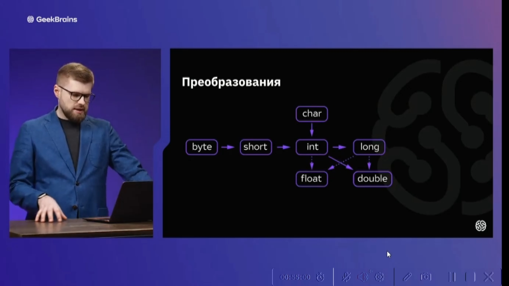

```javascript

-


```


</details>


-) Примеры преобразования

<details>

<summary></summary>


```javascript

/**
 * Program
 */
public class Program {

    public static void main(String[] args) {
        
        int i =123; double d = i;
        System.out.println(i); //123
        System.out.println(d); //123.0
        d = 3.1415; i = (int)d;
        System.out.println(i);//3
        System.out.println(d);//3.1415
        d = 3.9415; i = (int)d;
        System.out.println(d);//3.9415
        System.out.println(i);//3
        byte b = Byte.parseByte("123");
        System.out.println(b);//123
        b = Byte.parseByte("1234");
        System.out.println(b);// NumberFormatException: Value out of range
        
    
    }
}


```


</details>


-)  Получение иформации с терминала. Пример получения имени из терминала и возращения приветствия.

<details>

<summary></summary>


```javascript


/**
 Пример получения имени из терминала и возращения приветствия
 */
import java.util.Scanner;
public class program {

    public static void main(String[] args) {
        Scanner iScanner = new Scanner(System.in);
        System.out.println("name: ");
        String name = iScanner.nextLine();
        System.out.printf("Привет, %s!", name);
        iScanner.close();
    }
}


```


</details>


-) Пример получения чисел из терминала (int and double), сложение их с выводом в терминал

<details>

<summary></summary>


```javascript

/**
 Пример получения чисел из терминала (int and double), сложение их с выводом в терминал
 */
import java.util.Scanner;
public class program {

    public static void main(String[] args) {
        Scanner iScanner = new Scanner(System.in);
        System.out.printf("int a: ");
        int x = iScanner.nextInt();
        System.out.println("double a:");
        double y = iScanner.nextDouble();
        System.out.printf("%d + %f = %f", x, y, x + y);
        iScanner.close();
    }
}


```


</details>


-) Пример получения имени из терминала и возращении приветствия в проверкой валидности введенных данных

<details>

<summary></summary>


```javascript


/**
 Пример получения имени из терминала и возращении приветствия в проверкой валидности введенных данных
 */
import java.util.Scanner;
public class program {

    public static void main(String[] args) {
        Scanner iScanner = new Scanner(System.in);
        System.out.printf("int a: ");
        boolean flag = iScanner.hasNextInt();
        System.out.println(flag);
        int i = iScanner.nextInt();
        System.out.println(i);
        iScanner.close();
    }
}


```


</details>

-) Форматированный вывод. Конконтенация строк.

<details>

<summary></summary>


```javascript

/**
 Форматированный вывод. Конконтенация строк.
 */
public class program {

    public static void main(String[] args) {
        int a = 1, b = 2;
        int c = a + b;
        String res = a + " + " + b + " = " + c;
        System.out.println(res);
    }
}

Использование стандартных типов данных String и т.п. дает большую просадку по производительности, поэтому в реальном програмировании из использование не приемлемо, необходимо использовать специально предназначенные типы данных например: StringBuilder и т.п. 

```


</details>

-)  Использование спецификаторов маски вывода

<details>

<summary></summary>


```javascript

/**
 Использование спецификаторов маски вывода
 */
public class program {

    public static void main(String[] args) {
        int a = 1, b = 2;
        int c = a + b;
        String res = String.format("%d + %d = %d \n", a, b, c);// по данному синтаксису в маску вывода вместо спецификаторов: %d + %d = %d, вставляются значения следом идущих переменных: a, b, c (соотвественно последовательно)
        System.out.printf("%d + %d = %d \n", a, b, c);
        System.out.println(res);
    }
}


```


</details>

-) Виды спецификаторов

<details>

<summary></summary>

Спецификаторы:

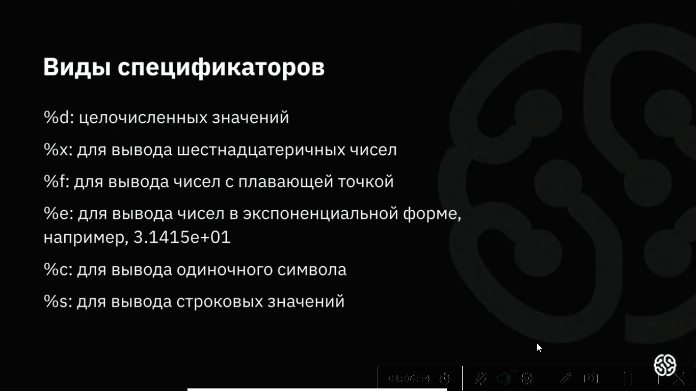

Дополнительные спецификаторы определящие количиство выводимых символов после запятой:


```javascript


```


</details>

-) Область видимости переменных

<details>

<summary></summary>


```javascript

/**
 область видимости переменных
 */
public class program {
    public static void main(String[] args) {
        int b = 111; // то, что с наружи (строка 6) может быть доступно внутри (в строке 8,9)
        {
        int a = 222;
        System.out.println(a + b); // то, что внутри (стоки 8,9) не может быть доступно снаружи ниже (сроки 11, 12)
        }
        int a = 123;
        System.out.println(a);
    }   
    
} //Кроме того нельзя объявить переменную с одним и тем же именем внутри (строки 8,9) и снаруже выше (строка 6)


```


</details>

-) Функции и методы

<details>

<summary></summary>

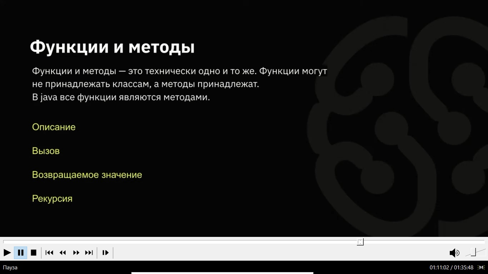
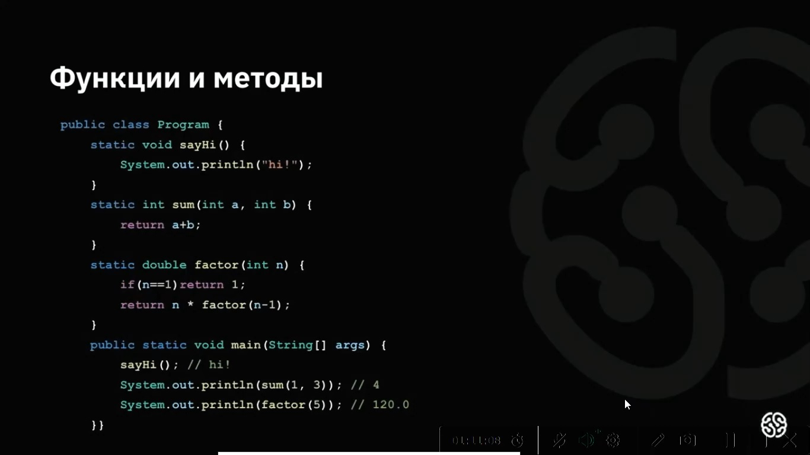

```javascript

/**
    Функции и методы
 */
public class program { // для описания функции должен быть класс

    static void sayHi() { // на данном этапе обязательно использовать слова static
        System.out.println("hi!");
}

static int sum(int a, int b){ // В скобках указаны аргументы: тип данных (int), индефикатор (а). Через запятую могут быть указаны все необходимые аргументы. В данном случае следующий аргумент, указан:  тип данных (int), индефикатор (b).
    return a + b;
}

static double factor (int n){
    if (n==1) return 1;
    return n * factor (n - 1);
}
public static void main(String[] args) {
sayHi(); // результат: hi!
System.out.println(sum(1, 3));    // результат: 4
System.out.println(factor(5)); // результат: 120.0
}}


```

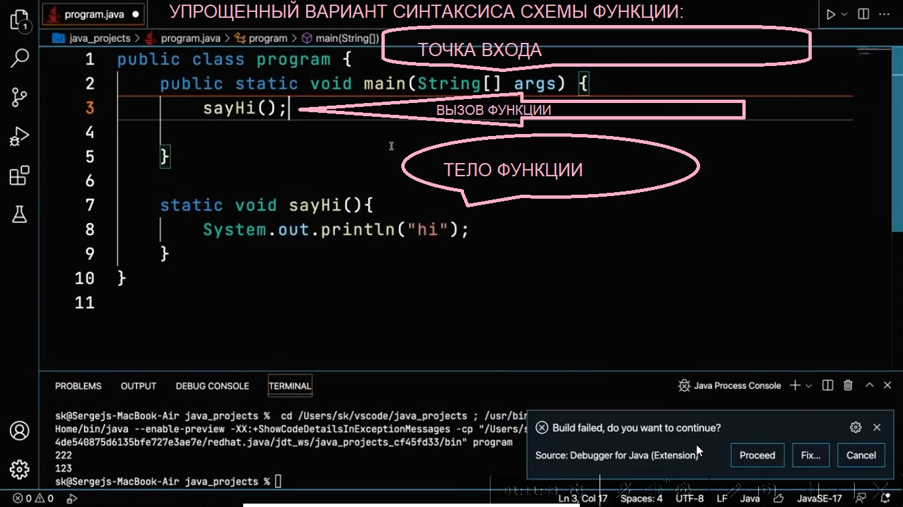

</details>

-) Функции и методы

<details>

<summary></summary>


```javascript

/**
    Функции и методы
 */
public class program { // для описания функции должен быть класс

    static void sayHi() { // на данном этапе обязательно использовать слова static
        System.out.println("hi!");
}

static int sum(int a, int b){
    return a + b;
}

static double factor (int n){
    if (n==1) return 1;
    return n * factor (n - 1);
}
public static void main(String[] args) {
sayHi(); // результат: hi!
System.out.println(sum(1, 3));    // результат: 4
System.out.println(factor(5)); // результат: 120.0
}}


```


</details>

-) Управляющие конструкции: условный оператора if

<details>

<summary></summary>


```javascript

/**
 Управляющие конструкции: условный оператора if
 */
public class program {

    public static void main(String[] args) {
        int a = 1;
        int b = 2;
        int c;
        if (a > b) { 
            c = a;
        } else {
            c = b;
        }
        System.out.println(c);
    
    }
}


```


</details>

-) Упрощеный вариант оператора if 

<details>

<summary></summary>


```javascript

/**
 Упрощеный вариант оператора if
 */

public class program {

    public static void main(String[] args) {
        int a = 1;
        int b = 2;
        int c = 0;
        if (a > b) c = a;
        if (b > a) c = b;

        System.out.println(c);
    
    }
}


```


</details>

-) Управляющие конструкции: тернарный оператор

<details>

<summary></summary>


```javascript

/**
 Управляющие конструкции: тернарный оператор
 */
public class program {

    public static void main(String[] args) {
        int a = 1;
        int b = 2;
        int min = a < b ? a : b; // если условие выполняется ( в данному случае: a < b), выполняется код после вопросительного знака до двоеточия. Если условие не выполняется, то вернется оператор после двоеточия ( в данном случае b). 
        System.out.println(min);
    
    }
}


```


</details>

-) Оператор выбора

<details>

<summary></summary>


```javascript

import java.util.Scanner;
/**
  Оператор выбора
 */
public class program {

    public static void main(String[] args) {
        int mounth = 12;
        String text = "";
        switch (mounth) {
            case 1:
                text = "Autumn";
                break;
                
                default:
                text = "mistake";
                break;
        
        }
    }
} 


```


</details>


-) Еще пример оператора выбора. Если а = 1, Print a, Если а = 2, Print b.

<details>

<summary></summary>


```javascript

/**
 * Еще пример оператора выбора. Если а = 1, Print a, Если а = 2, Print b. 
 */
public class program {

    public static void main(String[] args) {
        int a = 2;
        switch(a){
            case 1: System.out.println("a");
            break;
            case 2: System.out.println("b");
            break;
            }
        }
}


```


</details>

-) Еще пример оператора выбора. Если а = 1 или 2 или 3, Print true_found, Если а = 4, Print false_found.

<details>

<summary></summary>


```javascript

/**
 * Еще пример оператора выбора. Если а = 1 или 2 или 3, Print true_found, Если а = 4, Print true_found. 
 */
public class program {

    public static void main(String[] args) {
        int a = 2;
        switch(a){
            case 1:
            case 2:
            case 3:
                System.out.println("true_found");
            break;
            case 4: System.out.println("false_found");
            break;
            default:
            break;
            }
        }
}


```


</details>


-) Цикл While

<details>

<summary></summary>


```javascript

/**
 * Цикл While
 */
public class program {

    public static void main(String[] args) {
        int value = 321;
        int count = 0;

        while (value !=0){
            value /=10;
            count++;

        }

        System.out.println(count);
    }    
}


```


</details>

-) Цикл do while (цикл с постусловием, который с начала выполняет какое-то действие затем проверяет условие)

<details>

<summary></summary>


```javascript

/**
 Цикл do while (цикл с постусловием, который с начала выполняет какое-то действие затем проверяет условие)
 */
public class program {

    public static void main(String[] args) {
        int value = 321;
        int count = 0;

        do {
            value /=10;
            count++;
        } while (value !=0);
        System.out.println(count);
    }
}


```


</details>

-) Операторы для управления циклами

<details>

<summary></summary>

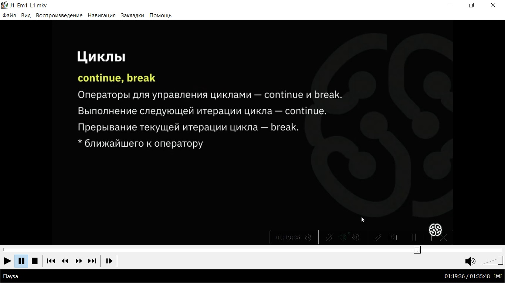

```javascript


```


</details>

-) Пример того, как  оператор continue помогает в цикле пропускать четные числа и в терминал выводятся только нечетные числа (если в if их == заменить на !=, то будет противоположный результатат, т.е. будут выводиться наоборот только четные числа)

<details>

<summary></summary>


```javascript

/**
 *  В данном случае оператор continue помогает в цикле пропускать четные числа и в терминал выводятся только нечетные числа (если в if их == заменить на !=, то будет противоположный результатат, т.е. будут выводиться наоборот только четные числа)
 */
public class program {

    public static void main(String[] args) {
        for (int i = 0; i < 10; i++){
            if(i % 2 == 0) {
                continue;
            }
            System.out.println(i);
        }
    }
}


```


</details>

-) Пример как оператор break помогает в ближайшем витке цикла прервать его выполение если при проверке if окажется четное число.  В результате выводятся цифры до первого четного числа в цикле (если в if  == заменить на !=, то будет противоположный результатат, т.е. цикл будет прерываться в случае появления нечетного числа)

<details>

<summary></summary>


```javascript


/**
 *  В данном случае оператор break помогает в ближайшем витке цикла прервать его выполение если при проверке if окажется четное число.  В результате выводятся цифры до первого четного числа в цикле (если в if  == заменить на !=, то будет противоположный результатат, т.е. цикл будет прерываться в случае появления нечетного числа)
 */
public class program {

    public static void main(String[] args) {
        for (int i = 0; i < 10; i++){
            if(i % 2 == 0) {
                break;
            }
            System.out.println(i);
        }
    }
}


```


</details>

-) Пример оператора: for

<details>

<summary></summary>


```javascript

  /**
   Оператор for
   */
  public class program {
  
    public static void main(String[] args) {
        int s = 0;
        for (int i = 1; i <= 10; i++) {
            s+=i;
        }
          System.out.println(s);
    }
  }


```


</details>

-) Пример вложенного цикла

<details>

<summary></summary>


```javascript

 /**
  Вложенный цикл
  */
 public class program {
 
    public static void main(String[] args) {
        for (int i = 0; i < 5; i++) {
            for (int j = 0; j < 5; j++) {
                System.out.print("* ");
            }
        }
    }
 }


```
Количество вложенных циклов не ограничено, но их наличие указывает на возможность рекурсии

Вложенные циклы могут быть любыми


</details>

-) Цикл for : (for in - который работае для коллекций)

<details>

<summary></summary>

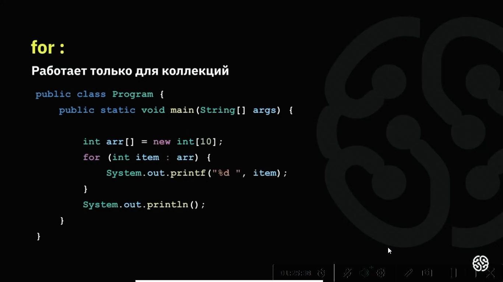

```javascript


```


</details>

-) Снипет for: (for in)

<details>

<summary></summary>


```javascript

foreach


```


</details>

-) for : (for in). Пример перебора коллекции и пример обращения к элементу коллекции по индексу.

<details>

<summary></summary>


```javascript

/**
 for : (for in). Пример перебора коллекции.
 */
public class program {

    public static void main(String[] args) {
        int[] arr = new int[] {1, 2, 3, 4, 5, 77};
        for (int item : arr) {
            System.out.println(item);
        }
    }
}


```

К элементам массива можно обращаться через индексы. 

```javascript


/**
 Пример обращения к элементам по индексу
 */
public class program {

    public static void main(String[] args) {
        int [] arr = new int [] {1, 2, 3, 4, 5, 77};
        for (int i = 0; i < arr.length; i++) {
            arr[i] = 10;
        }

        for (int item : arr) {
            System.out.println(item);
        }
        }
}


```
</details>

-) Работа с файлами. Создание и запись\дозапись

<details>

<summary></summary>


```javascript

import java.io.FileWriter;
import java.io.IOException;
/**
 Работа с файлами. Создание и запись\дозапись
 */
public class program {

    public static void main(String[] args) {
        try (FileWriter fw = new FileWriter("file.txt", true)) { // запись\дозапись (false\true)
            fw.write("line 1");
            fw.append('\n');
            fw.append('2');
            fw.append('\n');
            fw.write("line3");
            fw.flush();
        } catch (IOException ex) {
        System.out.println(ex.getMessage());
        }
} }


```


</details>

-) Чтение файла txt. Вариант посимвольно.

<details>

<summary></summary>


```javascript

import java.io.*;

import javax.annotation.processing.SupportedSourceVersion;
/**
 * Чтение файла txt. Вариант посимвольно.
 */
public class program {

    public static void main(String[] args) throws Exception {
        FileReader fr = new FileReader("file.txt");
        int c;
        while ((c = fr.read()) != -1) {
            char ch = (char) c;
            if (ch == '\n') {
                System.out.print(ch);
            } else {
                System.out.print(ch);
            }
        }
    }
}


```


</details>

-) Работа с txt-файлом. Вариант построчно.

<details>

<summary></summary>


```javascript

import java.io.*;
 /**
  *Работа с txt-файлом. Вариант построчно.
  */
 public class program {
 
    public static void main(String[] args) throws Exception {
        BufferedReader br = new BufferedReader(new FileReader("file.txt"));
        String str;
        while ((str = br.readLine()) !=null) {
            System.out.printf("== %s ==\n", str);
    }
    br.close();
    }
 }


```

</details>

-) Программа запрашивает число и вычисляет его факториал

<details>

<summary></summary>


```javascript

package Seminar1;
import java.util.Scanner;

/**
 * srm1_task4
 */
public class srm1_task4 {
public static void main(String[] args) {
starting();
}
private static void starting() {
    System.out.println(calculation());
}
static int calculation(){
    int source_to_result = 1;
    int calculation_end_value = end_value();
    int i = 0;
    for(i = 1; i <= calculation_end_value; i++){
    source_to_result *= i;
    }
    return source_to_result;
   
}
    static int end_value() {
    Scanner iScanner = new Scanner(System.in);
    System.out.println("Введите число ограничивающее данный цикл вычисления:");
    int x = iScanner.nextInt();
    iScanner.close();
    return x;  
    }
}


```

</details>


-) 

<details>

<summary></summary>


```javascript


```

</details>

-) 

<details>

<summary></summary>


```javascript


```

</details>

-) 

<details>

<summary></summary>


```javascript


```

</details>

-) 

<details>

<summary></summary>


```javascript


```

</details>


-) 

<details>

<summary></summary>


```javascript


```

</details>

-) 

<details>

<summary></summary>


```javascript


```

</details>

-) 

<details>

<summary></summary>


```javascript


```

</details>
