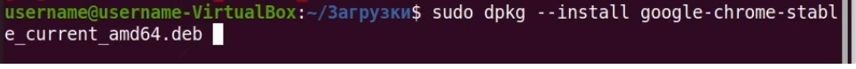
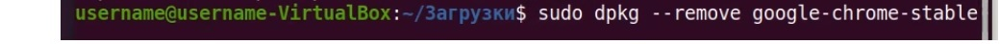

1)Обновить пакеты
<details>
<summary></summary>

```javascript

sudo apt update

sudo apt upgrade

sudo apt full-upgrade

```

</details>

..)Установить PyCharm

<details>
<summary></summary>

```javascript

Бесплатная версия (ограничение по базам данным и созданию сайтов):

sudo snap install pycharm-community --classic

Полная версия:

sudo snap install pycharm-professional --classic

```

</details>

..) Удаление Genymotion

<details>
<summary></summary>

```javascript

Из папки где было, (т.к. с помощью apt-get uninstall удаляется если только программа была установлена с помощью apt-get install)

./genymotion-3.1.2-linux_x64.bin --uninstall

```

</details>

..) установка программы с помощью dpkg

<details>

<summary></summary>



```javascript


```

</details>

..) Удалить программу с помощью dpkg

<details>

<summary></summary>



```javascript


```

</details>

..)Проверить установлен пакет или нет, его состояние с помощью dpkg
<details>
<summary></summary>

```javascript

dpkg -s jdk-19


```

</details>

..) Информацию о установленных пакетах скачать в текстовый файл
<details>
<summary></summary>

```javascript

dpkg --get-selections > ~/package.txt

```

</details>

..)вывести список установленных пакетов в терминал
<details>
<summary></summary>

```javascript

apt list --installed

или

dpkg --get-selections


```

</details>

..)Найти программу по ключевому слову

<details>

<summary></summary>

```javascript

sudo apt list --installed | ключевое слово

```

</details>

..) Удалить пакет с помощью apt
<details>
<summary></summary>

```javascript

sudo apt remove program_name

```

</details>

..) Синтаксис для работы с утилитой apt
<details>
<summary></summary>

```javascript

Синтаксис для работы с утилитой:

sudo apt опции команда имя_пакета
Команды apt для управления пакетами:

download ― скачать, но не устанавливать пакет;
update ― обновление информации о списках пакетов в репозиториях,
upgrade ― обновление системы без удаления пакетов,
full-upgrade ― полное обновление системы с удалением конфликтующих зависимостей,
install ― установка пакета,
remove ― удаление пакета, но без удаления конфигурационных файлов,
purge ― полное удаление пакета,
autoremove ― автоматическое удаление ненужных пакетов,
search ― поиск пакета в локальной базе данных,
show ― узнать информацию о пакете.
Основные опции:

c ― сторонний конфигурационный файл,
o ― строка конфигурации,
t ― версия релиза, для которой устанавливать пакет,
f ― выполнить операцию принудительно.

```

</details>

..).Проверьте, есть ли пакеты для установки в наших репозиториях. Для этого введите команду:

<details>

<summary></summary>

```javascript


apt search gimp

Вместо gimp вставьте название вашей программы.

```

</details>

..)...
<details>
<summary></summary>

```javascript

.....

```

</details>

..)...
<details>
<summary></summary>

```javascript

.....

```

</details>

..)...
<details>
<summary></summary>

```javascript

.....

```

</details>

..)...
<details>
<summary></summary>

```javascript

.....

```

</details>

..)...
<details>
<summary></summary>

```javascript

.....

```

</details>

..)...
<details>
<summary></summary>

```javascript

.....

```

</details>