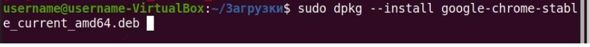
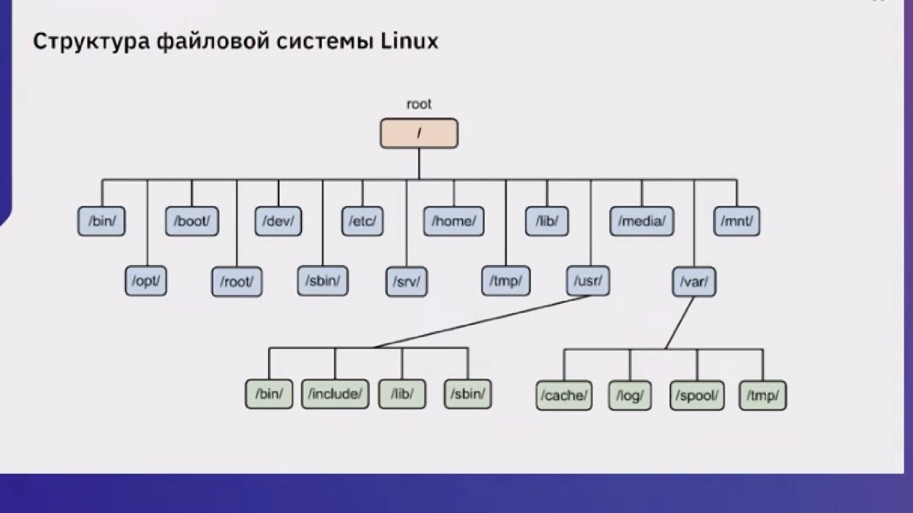

1)Обновить пакеты
<details>
<summary></summary>

```javascript

sudo apt update - обновить список пакетов (из терминала даете команду пойти в интернет и обновить из доступных репозиторием пакет)

sudo apt upgrade

sudo apt full-upgrade

```

</details>

..) Установить Midnight Commander (на 25.03.2023 крайняя версия 4.8.29 от 21.01.2023 г.в.)

<details>

<summary></summary>

```javascript

sudo apt install mc

```

</details>

..) установить оpenssh-server (SSH - сервер) для удаленного упралвения виртуальной(только-ли ?) машиной

<details>

<summary></summary>

```javascript

sudo apt install apenssh-server

```

</details>


..) инфа по ip

<details>

<summary></summary>

```javascript

ip

```

</details>


..)инфа по id

<details>

<summary></summary>

```javascript

id

```

</details>


..)Установить PyCharm

<details>
<summary></summary>

```javascript

Бесплатная версия (ограничение по базам данным и созданию сайтов):

sudo snap install pycharm-community --classic

Полная версия:

sudo snap install pycharm-professional --classic

```

</details>

..) Удаление Genymotion

<details>
<summary></summary>

```javascript

Из папки где было, (т.к. с помощью apt-get uninstall удаляется если только программа была установлена с помощью apt-get install)

./genymotion-3.1.2-linux_x64.bin --uninstall

```

</details>

..) установка программы с помощью dpkg

<details>

<summary></summary>



```javascript


```

</details>

..) Удалить программу с помощью dpkg

<details>

<summary></summary>


```javascript


```

</details>

..)Проверить установлен пакет или нет, его состояние с помощью dpkg
<details>
<summary></summary>

```javascript

dpkg -s jdk-19


```

</details>

..) Информацию о установленных пакетах скачать в текстовый файл
<details>
<summary></summary>

```javascript

dpkg --get-selections > ~/package.txt

```

</details>

..)вывести список установленных пакетов в терминал
<details>
<summary></summary>

```javascript

apt list --installed

или

dpkg --get-selections


```

</details>

..)Найти программу по ключевому слову

<details>

<summary></summary>

```javascript

sudo apt list --installed | ключевое слово

```

</details>

..) Удалить пакет с помощью apt
<details>
<summary></summary>

```javascript

sudo apt remove program_name

```

</details>

..) Синтаксис для работы с утилитой apt
<details>
<summary></summary>

```javascript

Синтаксис для работы с утилитой:

sudo apt опции команда имя_пакета
Команды apt для управления пакетами:

download ― скачать, но не устанавливать пакет;
update ― обновление информации о списках пакетов в репозиториях,
upgrade ― обновление системы без удаления пакетов,
full-upgrade ― полное обновление системы с удалением конфликтующих зависимостей,
install ― установка пакета,
remove ― удаление пакета, но без удаления конфигурационных файлов,
purge ― полное удаление пакета,
autoremove ― автоматическое удаление ненужных пакетов,
search ― поиск пакета в локальной базе данных,
show ― узнать информацию о пакете.
Основные опции:

c ― сторонний конфигурационный файл,
o ― строка конфигурации,
t ― версия релиза, для которой устанавливать пакет,
f ― выполнить операцию принудительно.

```

</details>

..).Проверьте, есть ли пакеты для установки в наших репозиториях. Для этого введите команду:

<details>

<summary></summary>

```javascript


apt search gimp

Вместо gimp вставьте название вашей программы.

```

</details>

..) Структура файловой системы Linux

<details>

<summary></summary>


```javascript

1) FHS (Filesystem Hierarchy Standard - страндарт иерархии файловой системы) во всех юникс подобных файловый системах кроме Виндовс и DOS;
2) верхний уровень - root
3) в bin - исполняемые файлы (бинарный файлы)
4) в boot - все что качается загрузки, ядро, настройки загрузчика.
5) в dev (от слова: devices) - виртуальные файлы предоставляемые операциаонной системой для обращения к устройствам 
6) в ets (от слова:  etsetera) - директория для настоек системы в целом
7) в home - каталоги для пользователей
8) в lib - библиотеки (это промежуточый уровень софта, часто устанавливается автоматически в качестве зависимостей от других пакетов)
9) в media - для подключения новых устройств (напимер втоой диск, так можено создать его директорию т.к. для любого нового устройства неоходимо создать каталог и туда подключить его (называется монтирование))
10) в mnt - тоже, что и media, но отличается тем, что как правило используется для временного подключения, например на один раз
11) opt - для дополнительного софта
12) root - директория суперпользоватеся администратора данной системы
13) sbin - тоже, что и bin, только заточены под работу системного администратора
14) srv - для работы серверной системы
15) в tmp - временные файлы используется для работы с тем, что не требует постоянного хранения
16) в usr - находятся пользовательские файлы, актуально в настоящее время для хранения реальных каталогов (din, include, lib, sbin - аналогичные раннее указанным и реально используюемые системой)
17) в var - (находятся директории cache, log, spool, tmp) в данной директории var находятся данные, изменяемые файлы, которые могут быть например журналами, данными приложений, например почтового сервера, базы данных, все ценное хранится в этой директории, потенциально данная директория быстро растет.


```



</details>


..) Сравнение каталогов

<details>

<summary></summary>

```javascript

diff --brief --recursive Dir1 Dir2
Files Dir1/client.log and Dir2/client.log differ
Files Dir1/file02 and Dir2/file02 differ
Files Dir1/file03 and Dir2/file03 differ
Only in Dir2: file04
Files Dir1/subdir1/file12 and Dir2/subdir1/file12 differ
Files Dir1/subdir2/file22 and Dir2/subdir2/file22 differ
Only in Dir2/subdir2: file23
Only in Dir1: subdir3
Копировать
Еще одна полезная опция утилиты diff – exclude, она позволяет отфильтровывать элементы, которые нас не интересуют в рамках сравнения. Чтобы исключить все файлы *.log из приведенного выше примера, мы добавляем –exclude=’*.log’ в команду:

diff --brief --recursive Dir1 Dir2 --exclude '*.log'
Files Dir1/file02 and Dir2/file02 differ
Files Dir1/file03 and Dir2/file03 differ
Only in Dir2: file04
Files Dir1/subdir1/file12 and Dir2/subdir1/file12 differ
Files Dir1/subdir2/file22 and Dir2/subdir2/file22 differ
Only in Dir2/subdir2: file23
Only in Dir1: subdir3
Копировать
Здесь следует иметь в виду одну вещь: утилита diff сравнивает файлы по содержимому, и это может привести к значительной задержке при больших объемах сравниваемых данных.

```

</details>


..)..

<details>

<summary></summary>

```javascript

..

```

</details>


..)..

<details>

<summary></summary>

```javascript

..

```

</details>


..)..

<details>

<summary></summary>

```javascript

..

```

</details>


..)..

<details>

<summary></summary>

```javascript

..

```

</details>


..)..

<details>

<summary></summary>

```javascript

..

```

</details>

..)..

<details>

<summary></summary>

```javascript

..

```

</details>

..)..

<details>

<summary></summary>

```javascript

..

```

</details>

..)..

<details>

<summary></summary>

```javascript

..

```

</details>

..)..

<details>

<summary></summary>

```javascript

..

```

</details>


..)..

<details>

<summary></summary>

```javascript

..

```

</details>


..)..

<details>

<summary></summary>

```javascript

..

```

</details>


..)..

<details>

<summary></summary>

```javascript

..

```

</details>


..)..

<details>

<summary></summary>

```javascript

..

```

</details>


..)..

<details>

<summary></summary>

```javascript

..

```

</details>


..)..

<details>

<summary></summary>

```javascript

..

```

</details>


..)..

<details>

<summary></summary>

```javascript

..

```

</details>


..)..

<details>

<summary></summary>

```javascript

..

```

</details>


..)..

<details>

<summary></summary>

```javascript

..

```

</details>


..)..

<details>

<summary></summary>

```javascript

..

```

</details>


..)..

<details>

<summary></summary>

```javascript

..

```

</details>


..)..

<details>

<summary></summary>

```javascript

..

```

</details>


..)..

<details>

<summary></summary>

```javascript

..

```

</details>


..)..

<details>

<summary></summary>

```javascript

..

```

</details>


..)..

<details>

<summary></summary>

```javascript

..

```

</details>


..)..

<details>

<summary></summary>

```javascript

..

```

</details>

