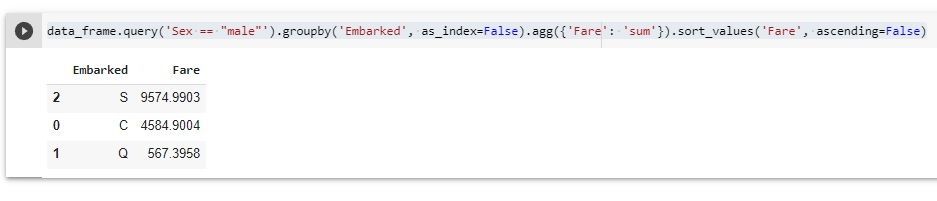

-) Объявление библиотек: Пандас, Сиборн(sns), Плотли. 

<details>
<summary></summary>

```javascript

import pandas as pd
import matplotlib.pyplot as plt
%matplotlib inline
import seaborn as sns

```
Строка: 
%matplotlib inline
использована для правильного расположения выводимым данных (полагаю - графиков)

</details>

-) Присваивание данных файла csv переменной
<details>

<summary></summary>

```javascript

data_frame = pd.read_csv('train (2).csv')

```

</details>
-) Чтение из переменной присвоенных данных файла csv

<details>
<summary></summary>

```javascript

data_frame

```


</details>

-) Использования функции describe() для получения основных метрических статистических данных данных (наибольшее значекние, наименьшее, среднее, медианнф, процентива и т.д.

<details>
<summary></summary>

```javascript

data_frame.describe()

```
.jpg)

Использование фнукции describe()

</details>

-) Исполользование функции info()

<details>

<summary></summary>

```javascript

data_frame.info()

```


.jpg)

non-null - обзначает отсутствие нулевых данных (часто null - это могут быть в том числе и битые данные)

</details>

-) Обращение к конкретному столбцу по имени.


<details>

<summary></summary>

```javascript

data_frame.Age

```


</details>

Пример переименования столбцов.


<details>

<summary></summary>

```javascript

data_frame.rename(columns ={'Age' : 'age', 'Pclass' : 'class' })


```


pandas воспинимает информацию в файле как набор словарей, и принимает соотвествующих сиснтаксис Pyton для словарей. Что бы изменения сохрарились, измененные данные необходимо пересохранить в переменную.

</details>


-) Удаление нулевых значений.


<details>

<summary></summary>

```javascript

data_frame.dropna()

```
.jpg)

</details>

-) Запрос данных по столбцу строк имеющих определенное значение.


<details>

<summary></summary>

```javascript

data_frame.query('Sex == "male"')

```

данные типа flout берутся в ковычки дополнительно

</details>


-) Пример сложного запроса с несколькими критериев

<details>
<summary></summary>


```javascript

data.query('Senior_Management == True 
            and Gender =="Male" and Team =="Marketing" 
            and First_Name =="Johnny"', inplace = True)

```


</details>


-) Использование функции shape для возвращения картежа 

<details>

<summary></summary>

```javascript

data_frame.query('Sex == "male"').shape[0]

```


</details>

-) Пример применение функции value_counts к определенному столбцу (в данном случае к столбцу Age). 

<details>

<summary></summary>

```javascript

data_frame.Age.value_counts

```


</details>

-) Использование функции normalize, функции mul, функции round для  получения значения в разряде 100 процентов. Примечание: в классическом Python не работает.). Также использует функция round для сокращения разрядов дробей.


<details>

<summary></summary>

```javascript

data_frame.Age.value_counts(normalize=True).mul(100).round(2)

```


</details>

-) Групировка по групам и сложение данных принадлежащих каждой группе.


<details>

<summary></summary>

```javascript

data_frame.groupby('Embarked').agg({'Fare': 'sum'})

```


 В данном случае группы классы мест пассажиров. Суммы это суммы денежных средств потраченных на билеты каждой группой.

</details>

-) Применение сортировки по возрастанию.


<details>

<summary></summary>

```javascript

data_frame.groupby('Embarked').agg({'Fare': 'sum'}).sort_values('Fare')

```


</details>

-) Применение сортировки по убыванию.

<details>

<summary></summary>

```javascript

data_frame.groupby('Embarked').agg({'Fare': 'sum'}).sort_values('Fare', ascending=False

```


В данном случае используется присваение False свойству ascending.

</details>

-) Для выравнивания убираем из индекса data_frame.groupby

<details>

<summary></summary>

```javascript

data_frame.groupby('Embarked', as_index=False).agg({'Fare': 'sum'}).sort_values('Fare', ascending=False)

```


Убираем из индекса путем присваивания значения: as_index=False

</details>

-) Ограничиваем данные пассажиров Титаника в выборке по полю Sex мужчинами

<details>
<summary></summary>

```javascript

data_frame.query('Sex == "male"').groupby('Embarked', as_index=False).agg({'Fare': 'sum'}).sort_values('Fare', ascending=False)

```



</details>


-) Присваивание переменной fv значения файла 2_taxi_nyc.csv (для дальнейшей работы с этим файлом) и вывод данных на экран 

<details>
<summary></summary>

```javascript

fv = pd.read_csv('2_taxi_nyc.csv')

fv

```


</details>

-) Задача посчитать сколько было поездок каждый месяц в каждой группе

<details>
<summary></summary>

```javascript

fv_t.groupby(['borough', 'pickup_month'], as_index=False).agg({'pickups':'sum'}).sort_values('pickups', ascending=False)

```


</details>

-) Задача создать функцию которая переводит температуру из разряда исчисления в Фарингейтах, в разряд исчисления по Цельсию и вывести в новом созданном отдельном столбце.

а. Созадем функцию

<details>
<summary></summary>

```javascript

def temper (f):
  temper_c = (f - 32)*5/9
  return temper_c 

```


</details>

б. Создаем столбец и присваиваем значения функции пересчета данных исчисления температуры по Фарингейту в данные исчисления температуры по Цельсию. Ниже выводим результат:


<details>
<summary></summary>

```javascript

fv ['temper_c'] = temper(fv.temp).round(2)

```


</details>


