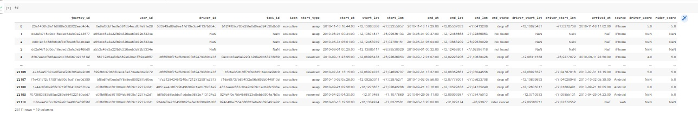

-) -

<details>
<summary></summary>

```javascript

import pandas as pd
import matplotlib.pyplot as plt
%matplotlib inline
import seaborn as sns

```


</details>


-) -

<details>
<summary></summary>

```javascript

fd = pd.read_csv('3_taxi_peru (1).csv')

```


</details>


-) -

<details>
<summary></summary>

```javascript

fd

```


вывод (параметры вывода файла) требуют изменения (дополнения) для корректного вывода

</details>


-) -

<details>
<summary></summary>

```javascript

fd = pd.read_csv('3_taxi_peru (1).csv', sep = ';', parse_dates=['start_at', 'end_at', 'arrived_at'])

```


</details>


-) -

<details>
<summary></summary>

```javascript

fd

```




</details>


-) -

<details>
<summary></summary>

```javascript

fd.info()

```

.jpg)


</details>


-) -

<details>
<summary></summary>

```javascript

fd.dtypes

```


</details>


-) -

<details>
<summary></summary>

```javascript

fd.source.value_counts(normalize=True).mul(100).round(2)

```


</details>


-) -

<details>
<summary></summary>

```javascript

v_taxi = fd.groupby('source', as_index = False).agg({'user_id':'count'}).sort_values('user_id', ascending =False)\
  .rename(columns = {'user_id' : 'piple'})

```


</details>


-) -

<details>
<summary></summary>

```javascript

v_taxi

```


</details>


-) -

<details>
<summary></summary>

```javascript

sns.barplot(data = v_taxi, x = 'source', y = 'piple')

```


</details>


-) -

<details>
<summary></summary>

```javascript

sns.countplot(fd.source)

```


</details>


-) -

<details>
<summary></summary>

```javascript

sns.countplot(fd.end_state)

```


</details>


-) -

<details>
<summary></summary>

```javascript

plt.figure(figsize=(10,8))

```


</details>


-) -

<details>
<summary></summary>

```javascript

dsc = fd.driver_score.value_counts(normalize=True).mul(100).round(2).reset_index()\
        .rename(columns = {'index' : 'driver_score', 'driver_score' : 'percentage'}).sort_values('driver_score')

```


</details>


-) -

<details>
<summary></summary>

```javascript

dsc

```


</details>


-) -

<details>
<summary></summary>

```javascript

pl = sns.barplot(data = dsc, x = 'driver_score', y = 'percentage', color='red',alpha = 0.6)

```


</details>


-) -

<details>
<summary></summary>

```javascript

-

```


</details>


-) -

<details>
<summary></summary>

```javascript

-

```


</details>


-) -

<details>
<summary></summary>

```javascript

-

```


</details>


-) -

<details>
<summary></summary>

```javascript

-

```


</details>


-) -

<details>
<summary></summary>

```javascript

-

```


</details>


-) -

<details>
<summary></summary>

```javascript

-

```


</details>


-) -

<details>
<summary></summary>

```javascript

-

```


</details>


-) -

<details>
<summary></summary>

```javascript

-

```


</details>


-) -

<details>
<summary></summary>

```javascript

-

```


</details>


-) -

<details>
<summary></summary>

```javascript

-

```


</details>


