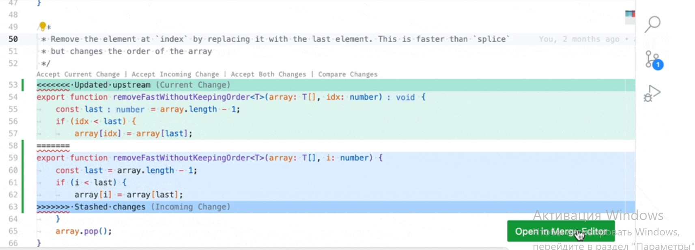
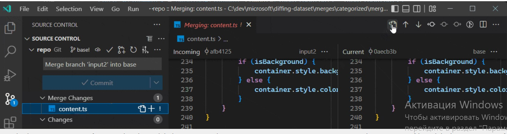

-) Источник первого блока инфы:

<details>

<summary></summary>


```javascript

VSCode, обновление 1.71.2: устраняет проблемы (с видео  изменений и новых приемов работы на 11.06.2023 по ссылке:
https://github.com/microsoft/vscode-docs/blob/vnext/release-notes/v1_71.md#ffmpeg-codecs-support)

```

</details>

-) Улучшение в редакторе слияния 1

<details>

<summary></summary>


```javascript

Открытие редактора слияния из файлов с конфликтами
Файл, в котором возник конфликт, теперь автоматически отобразит кнопку Открыть в редакторе слияния для перехода между текстовым редактором и редакторами слияния.

```



</details>


-) Улучшение в редакторе слияния 2

<details>

<summary></summary>


```javascript

Файл редактора слияния не изменен при открытии
VS Code больше не изменяет результирующий файл при его открытии в редакторе слияния (конфликтующие области были заменены на base). Вместо этого маркеры конфликта остаются в файле, но скрыты в представлении результатов. Флажки можно использовать для замены маркеров конфликта на любую сторону, комбинацию обеих сторон или, сняв их, на base.

Восстановление старых декораторов конфликтов
Старые встроенные средства оформления конфликтов больше не отключены, поэтому редактор слияния и встроенный интерфейс можно использовать вместе. Когда откроется редактор слияния, вы можете получить предыдущий опыт одним щелчком мыши на панели инструментов редактора:

(Щелкнув тот же значок рядом с именем файла в представлении управления версиями, вы можете полностью пропустить редактор слияния.

Однако вы можете переключаться между новым и старым интерфейсом в любое время и даже использовать их параллельно)

```


</details>


-) Улучшение в редакторе свлияния 3... и др.

<details>

<summary></summary>


```javascript

Улучшения флажков
Теперь мы удостоверяемся, что флажки конфликта всегда видны, даже если размер конфликта превышает размер окна просмотра. Цвета используются для выделения флажков для необработанных конфликтов.

Улучшения различных алгоритмов
Мы начали изучать альтернативные алгоритмы различения, чтобы улучшить качество конфликтов. Новый экспериментальный алгоритм дифференцирования может быть включен с помощью следующей настройки:

"mergeEditor.DiffAlgorithm": "экспериментальный",
Этот новый алгоритм еще не оптимизирован для повышения производительности, но улучшает работу редактора слияния для многих крайних случаев.

Дальнейшие действия
В этом выпуске мы сосредоточились на наиболее важных проблемах UX редактора слияния и исправили множество ошибок. Если вас все еще смущает новый редактор слияния, мы будем рады услышать ваше мнение! Пожалуйста, создайте новую проблему в нашем репозитории, поделитесь скриншотом и состоянием вашего редактора слияния (используя команду Копировать состояние редактора слияния в формате JSON). Мы действительно ценим все отзывы, которые мы получили на данный момент, и дополнительные отзывы помогут нам сделать работу редактора слияния удобной для всех.

Наша будущая работа будет сосредоточена на отдельном базовом представлении, минимизации конфликтов, уточнении различных алгоритмов и других улучшениях.


```

</details>


-) Webview API ( ссылка на 11.06.2023 https://code.visualstudio.com/api/extension-guides/webview) для vscode версии 1.79

<details>

<summary></summary>


```javascript

Webview API позволяет расширениям создавать полностью настраиваемые представления в Visual Studio Code. Например, встроенное расширение Markdown использует webviews для отображения предварительных просмотров Markdown. Webviews также можно использовать для создания сложных пользовательских интерфейсов, выходящих за рамки того, что поддерживают собственные API VS Code.

Думайте о webview как о iframe элементе внутри VS Code, которым управляет ваше расширение. Webview может отображать практически любой HTML-контент в этом фрейме и взаимодействует с расширениями с помощью передачи сообщений. Эта свобода делает webviews невероятно мощным и открывает целый ряд новых возможностей расширения. При дальнейшем прочтении инфы: (ссылка на https://code.visualstudio.com/api/extension-guides/webview) для vscode версии 1.79 по состоянию  11.06.2023 где описаны подробно приемы работы с Webview) следует, что данная фишка ресурсоемка и не рекомендуется к использованию если имеются другие средства реализации.

```

</details>

-) поддержка кодеков FFmpeg

<details>

<summary></summary>


```javascript
(11.06.2023 источник: https://ffmpeg.org/)
 FFmpeg
Комплексное кроссплатформенное решение для записи, конвертации и потоковой передачи аудио и видео.
Конвертировать видео и аудио еще никогда не было так просто.
$ ffmpeg -i ввод.вывод в формате mp4.avi

Новая основная версия, FFmpeg 6.0 "Von Neumann", теперь доступна для скачивания. В этом выпуске появилось много новых кодеров и декодеров, фильтров, улучшены инструменты командной строки ffmpeg, а также изменен способ выполнения релизов. Все основные выпуски теперь будут обновлять версию ABI. Мы планируем выпускать новый крупный релиз каждый год.

Представлены новые декодеры Bonk, RKA, Radiance, SC-4, APAC, VQC, WavArc и несколько форматов ADPCM. QSV и NVenc теперь поддерживают кодировку AV1. Интерфейс командной строки FFmpeg (мы обычно называем его ffmpeg.c, чтобы избежать путаницы) улучшен благодаря потоковой обработке, а также параметрам статистики и возможности передавать значения параметров для фильтров из файла. Появилось довольно много новых аудио- и видеофильтров, таких как adrc, showcwt, backgroundkey и ssim360, а также несколько аппаратных фильтров. Наконец, релиз содержит множество изменений за кадром, включая новую реализацию FFT и MDCT, используемую в кодеках (ожидайте сообщение в блоге об этом в ближайшее время), многочисленные исправления ошибок, улучшенную обработку профиля ICC и улучшение сигнализации цветового пространства, внедрение ряда оптимизированных для векторной и скалярной сборки RISC-V подпрограмм, а также несколько новых улучшенных API, которые можно просмотреть в файле doc / APIchanges в нашем дереве. Несколько представленных функций, таких как улучшения Vulkan и дополнительная оптимизация FFT, появятся в следующем второстепенном выпуске, 6.1, который мы планируем выпустить в ближайшее время, в соответствии с нашим новым графиком выпуска. Некоторые основные моменты:

Поддержка изображений Radiance HDR
фильтр видеозахвата ddagrab (дублирование рабочего стола)
ffmpeg - параметр shortest_buf_duration -наименьшее значение
для построения ffmpeg теперь требуется потоковая обработка
ffmpeg теперь запускает каждый мультиплексор в отдельном потоке
Добавьте новый режим в фильтр cropdetect для определения области обрезки на основе векторов движения и краев
Декодирование и кодирование VAAPI для 10/12-битного 422, 10/12-битного 444 HEVC и VP9
Формат изображения WBMP (растровое изображение по протоколу беспроводного приложения)
фильтр a3dscope
декодер ошибок и демультиплексирующее устройство
Аудиодекодер Micronas SC-4
Демультиплексирующее устройство LAF
Декодер APAC и демультиплексирующее устройство
Декодеры мультимедиа 100i
С DTS на PTS изменить порядок bsf
Декодер ViewQuest VQC
фильтр фоновых клавиш
поддержка кодирования nvenc AV1
Декодер MediaCodec через NdkMediaCodec
Кодировщик MediaCodec
Поддержка oneVPL для QSV
Кодировщик QSV AV1
QSV-декодирование и кодирование для 10/12-битного 422, 10/12-битного 444 HEVC и VP9
мультимедийный фильтр showcwt
corr видео фильтр
аудиофильтр adrc
аудиофильтр afdelaysrc
WADY DPCM декодер и демульсификатор
Декодер CBD2 DPCM
видеофильтр ssim360
новые параметры командной строки ffmpeg: -stats_enc_pre[_fmt], -stats_enc_post[_fmt], -stats_mux_pre[_fmt]
фильтры hstack_vaapi, vstack_vaapi и xstack_vaapi
Декодер XMD ADPCM и демультиплексирующее устройство
media100 в mjpegb bsf
новая опция командной строки ffmpeg: -fix_sub_duration_heartbeat
Декодер WavArc и демультиплексирующее устройство
Декодеры CrystalHD устарели
Демультиплексирующее устройство SDNS
RKA-декодер и демультиплексирующее устройство
синтаксис filtergraph в ffmpeg CLI теперь поддерживает передачу содержимого файла в качестве значений параметров
фильтры hstack_qsv, vstack_qsv и xstack_qsv
Мы настоятельно рекомендуем пользователям, дистрибьюторам и системным интеграторам выполнить обновление, если они не используют текущий git master. На странице ресурса указанны и другие новые релизы.

```

</details>


-) 

<details>

<summary></summary>


```javascript

(11.06.2023 источник https://www.opennet.ru/opennews/art.shtml?num=57761)

Опубликован свободный звуковой кодек FLAC 1.4
10.09.2022 21:24
Спустя девять лет с момента публикации прошлой значительной ветки сообщество Xiph.Org представило новую версию свободного кодека FLAC 1.4.0, обеспечивающего кодирование звука без потери качества. FLAC использует только методы кодирования без отбрасывания данных (lossless), что гарантирует полную сохранность изначального качества звукового потока и его идентичность с эталонным вариантом, подвергнутым кодированию. При этом используемые методы сжатия без потерь позволяют уменьшить размер исходного звукового потока на 50-60%. FLAC является полностью свободным потоковым форматом, подразумевающим не только открытость библиотек с реализацией функций кодирования и декодирования, но и отсутствие ограничений по использованию спецификаций и созданию производных вариантов. Код библиотек распространяется под лицензией BSD.

Из наиболее важных изменений можно отметить:

Добавлена поддержка кодирования и декодирования с разрядностью квантования 32 бит на выборку (bit-per-sample).
Повышена эффективность сжатия на уровнях с 3 по 8 ценой небольшого снижения скорости кодирования из-за повышения точности вычисления автокорреляции. Увеличена скорость кодирования для уровней 0, 1 и 2. Немного улучшено сжатие на уровнях с 1 по 4 за счёт изменения адаптивной эвристики.
Значительно повышена скорость сжатия на 64-разрядных процессорах ARMv8, благодаря задействованию инструкций NEON. Повышена производительность на процессорах x86_64, поддерживающих набор инструкций FMA.
Изменены API и ABI библиотек libFLAC и libFLAC++ (при обновлении до версии 1.4 требуется пересборка приложений).
Объявлен устаревшим и будет удалён в следующем выпуске плагин для XMMS.
В библиотеке libFLAC и утилите flac предоставлена возможность ограничения минимального битрейта для FLAC-файлов, вплоть до одного бита на выборку (может быть полезным при организации live-вещания).
Стало возможным кодирование файлов с частотой дискретизации до 1048575 Hz.
В утилите flac реализованы новые опции "--limit-min-bitrate" и "--keep-foreign-metadata-if-present".


```

</details>

-) VSCode, обновление 1.71.2 поддержка кодеков FFmpeg (источник 11.06.2023 https://github.com/microsoft/vscode-docs/blob/vnext/release-notes/v1_71.md#ffmpeg-codecs-support)

<details>

<summary></summary>


```javascript

Разделяемая библиотека FFmpeg, которая поставляется как часть VS Code, ранее поддерживала только FLAC кодек. В этом выпуске библиотека была обновлена для поддержки следующего списка кодеков и контейнеров. Это позволит воспроизводить больше аудио- и видеофайлов с ноутбуков или с помощью расширений, встраивающих аудио- и видеофайлы в webviews.

Vorbis
Flac
H.264
VP8
WAV
MP3
Ogg

```

</details>


-) Дополнительный ресурс по звуку в VSCode

<details>

<summary></summary>


```javascript

https://stackru.com/questions/52463181/vosproizvedenie-zvuka-v-webview-predostavlyaemom-vscode

```

</details>

-) запрос

<details>

<summary></summary>


```javascript

hyperlink markdown in vscode

Доброго времени. Пытаюсь локальный html файл с видео на локальном компьютере с помощью гиперссылки из документа MarkDown в VSCode (ОС Windows11) открыть в текущем браузере. Ни чего не выходит. Ссылки которые работают из html, не работают в MarkDown. По подсказкам в internet либо html файл открывается в VSCode, либо открывается новая вкладка в браузере, с сообщением, что файл не найден. Буду благодарен за любую подсказку.  

```

</details>

-) 

<details>

<summary></summary>


```javascript


```

</details>-) 

<details>

<summary></summary>


```javascript


```

</details>-) 

<details>

<summary></summary>


```javascript


```

</details>-) 

<details>

<summary></summary>


```javascript


```

</details>